# Miniforge + VS Code によるPython/R 環境構築(Mac編)

## はじめに

データサイエンスや機械学習の分野で研究・開発を行うためには、使いやすいプログラミング環境が欠かせません。
本資料では、次の2つのツールを導入していきます。

* **Miniforge（ミニフォージ）**：
Python の代表的な環境構築ツール conda を、より軽量かつ最新の形で利用できる仕組みです。データ解析や AI 開発に必要なライブラリを簡単に追加でき、さらに Jupyter Notebook（ジュピター） を通じて、コードと文章・図を組み合わせた“実験ノート”を作ることだってできます。
  * [余談だけど重要なこと] これまで世界中の大学では、学生にAnaconda(アナコンダ)という名称の無料の環境構築ツールをインストールするよう指示してきました。ところが2020年くらいから、たとえ大学であっても大人数授業で使う場合は、Anacondaの利用に際して料金を支払うようにライセンスが改悪されてしまいました。それでは困るので、同じような機能かつ*無償利用が保証され、しかもMacではAnacondaよりも動作が早い*、Miniforgeを採用する企業や大学が増えてきています。
* **Visual Studio Code（VS Code／ブイエスコード）**：Microsoft 社が開発する高機能エディタで、Python や R を効率よく書くための便利な機能が豊富にそろっています。世界中の学生・研究者・エンジニアに利用されており、プログラミング学習から実務まで幅広く活用できます。当然、無料で使えます。

これらを組み合わせて使うことで、授業や研究だけでなく、業界でも通用する「プロフェッショナルな作業環境」を自分のPCに整えることができます。

下図が環境のイメージです。

* JupyterとPythonに関しては、Miniforgeが常にきちんと動くように面倒を見てくれる
* Visual Studio Codeの中で、プログラムを書いて、Jupyter経由でPythonとRに実行させる


1回この環境を完成させれば、卒業まで困ることはありません。頑張ってまいりましょう。ひとつだけ注意点をお伝えします。

ここで行う作業の後半では、「半角文字でコマンドを入力する」という慣れない操作を行うことがあります。この操作は煩雑に見えますが、最も簡単なやり方は、書かれいてるコマンドを慎重に選択→コピーして、ペーストする(貼り付ける)ことです。コピーとペーストはマウスやタッチバッドのの右クリックで実行できます。


## インストール作業を始める前の準備

### 準備1：CPUのタイプを知る

現在、**Intel CPU**を搭載したIntel Mac(少し古いMac)と、**ARM CPU**を搭載したSilicon Mac(現行品; M1ーM4といった名前がついている)の2種類のMacが流通しています。多くの人はSilicon Macを使っているはずですが、念のため確認してみましょう。

画面左上端に林檎マークのアイコンがあり、これをクリックして「**このMacについて**」を選択します。

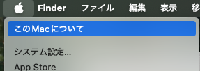

出現するウィンドウには、機種名の下に**チップ**という項目があり、そこにCPUの名称が書かれています。

* 「**Apple M1 (またはM2, M3, M4)**」ならば、お使いのMacは**Apple Silicon** です。

* 「**Intel Core i7 (または i5)**」ならば、**Intel**です。下の図では、チップがApple M1なので、**Apple Silicon**であることが分かります。

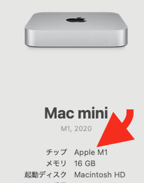

### 準備2：「ターミナル.app」を起動する

Mac OSの標準アプリ「**ターミナル.app**」を起動します。
このアプリは次の場所にあります：

`アプリケーション(フォルダ) > ユーティリティ(フォルダ) > ターミナル`


起動すると、次のような外観の(殺風景な)ウィンドウが出現します。

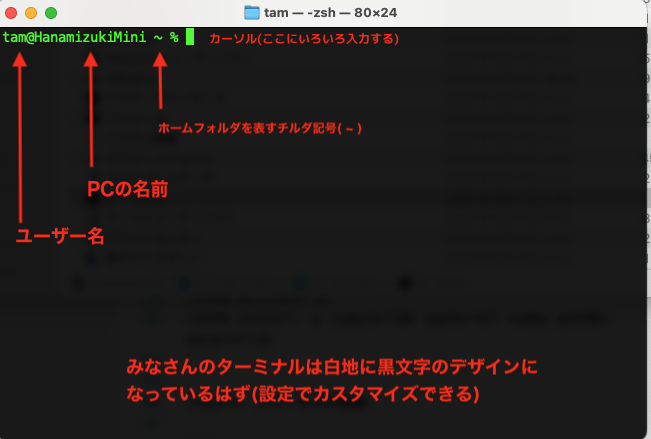

Miniforgeのインストール作業では、このターミナルに幾つかの命令をタイプ(入力)していきますので、起動したままにしてください。

**以上で準備は完了です！**

## Miniforge3のインストール

### 1. インストーラーのダウンロード

SafariやChromeなどで、MiniforgeのWebサイト：
[https://conda-forge.org/download/](https://conda-forge.org/download/)にアクセスします：

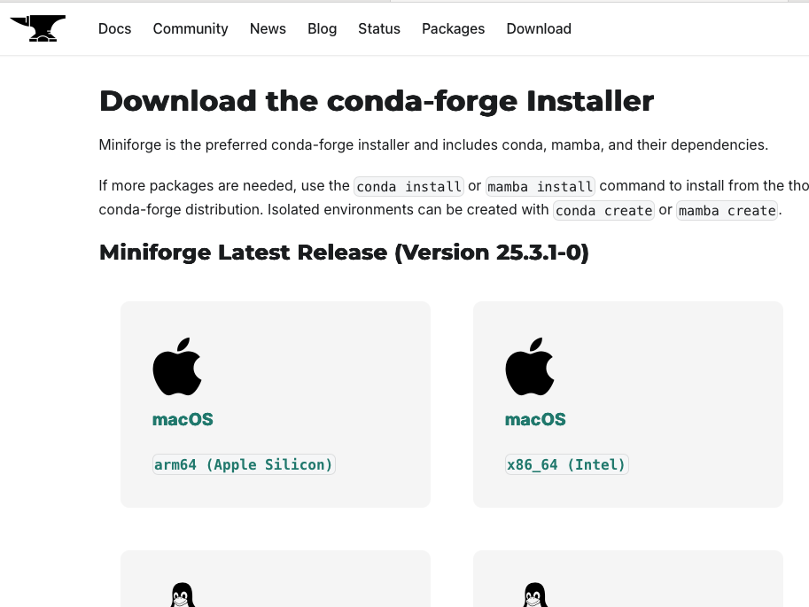

上の準備で調べたように、お使いのMacが**Apple Silicon** か **Intel** のどちらかに応じて、適切なインストーラーをダウンロードしましょう。私のMacの場合は、CPUはM1だったので、Apple Siliconの`arm64 (Apple Silicon)`をクリックしてダウンロードします。

ダウンロードしたインストーラーは、「**ダウンロード**」フォルダに保存されています。このフォルダにターミナルからアクセスします。

ターミナルのカーソル部分をクリックして、次のコマンドを入力してください。

`cd Downloads`

このコマンドは「ダウンロードフォルダに移動する」という意味です。アルファベット・空白ともに半角で入力することに注意（以降も同様です）。その結果、ターミナルの表示が

`ユーザー名@PC名 Downloads %`

に変更されたら成功です(下図参照)。以降のターミナル作業は、ダウンロードフォルダの中で行われることになります。

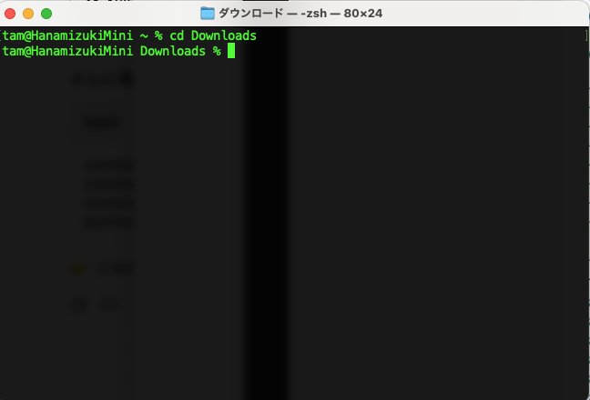

### 2. インストール作業開始

それではインストール作業を始めます。まず、次のコマンドを正確にマウスでコピーしてください。

`bash Miniforge3-$(uname)-$(uname -m).sh`

次に、ターミナルのカーソル付近にマウスを移動して、右クリック→ペーストを選択してください。コピーしたコマンドを貼り付けようとしています。

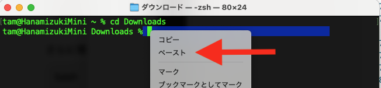

うまく貼り付けられたら、下の画像のようになるはずです。うまくいかなかったら、バックスペースキーをタイプして貼り付けた内容を全削除してリトライします。

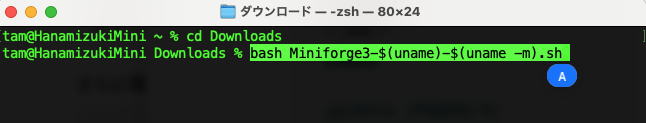

Enter(リターン)キー↩️を叩きます。すると、Miniforgeインストーラーが起動します。下図のように `Welcome to Miniforge3...`のようなメッセージと、ターミナルの最終行に`>>>`というプロンプトが表示されていることを確認します。

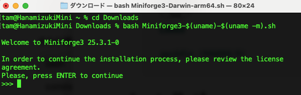

Enterキーをタイプすると、ライセンスが表示されます。私たちは**同意**する必要があります。下図の画面の状態でキーボードの `q` をタイプします。

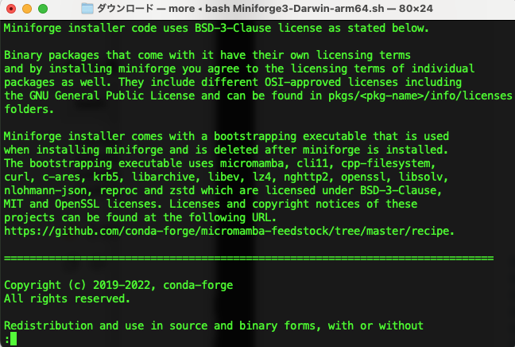

すると、画面が少し変化し、ターミナル最下部あたりに `Do you accept the license terms?`(ライセンスに同意しますか？)という質問が表示されます。`yes`とタイプして、Enter↩️します。


### 3. インストール先の決定

次に、Miniforgeをインストールするフォルダを決定します。デフォルトでは、みなさんのホームフォルダ直下に：
`/Users/(ユーザー名)/miniforge3`
というフォルダを新規作成し、その中にMiniforgeシステムをインストールします。ところが、*ユーザー名に空白が入っていたり、日本語やヨーロッパ系のアクセント文字が入っていると、うまく動かないことが知られています*。私のユーザー名(`tam`)のように、空白のない半角文字のみならばその心配はないので、ここでは以下の指示をスキップし、ENTERキーを入力して次の「4.」に進んでもOKです。

それ以外の人、よく分からない人は、以下の手順を踏みます。現在、ターミナルではインストール先のフォルダを指定する局面にいます(下図)。

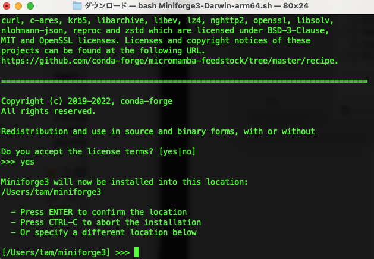

このカーソルのところに、次のように入力してください。**半角英数字、大文字小文字の区別、「/」**(スラッシュ記号、キーボードの右下あたりにあります)に注意。入力すると、下図のようになります。

`/Users/Shared/miniforge3`

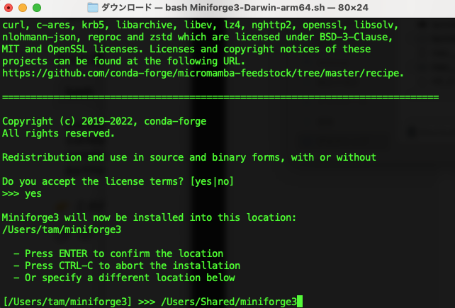

この`/Users/Shared`という場所は、Macでは「共有」というフォルダとして見えています。「共有フォルダの中に`miniforge3`というフォルダを新規作成し、その中にMiniforgeをインストールしていく」、ということを意味しています。

さて、ここでENTERキーを入力すると、インストール作業が自動的に始まります。下図は実行中の画面です。

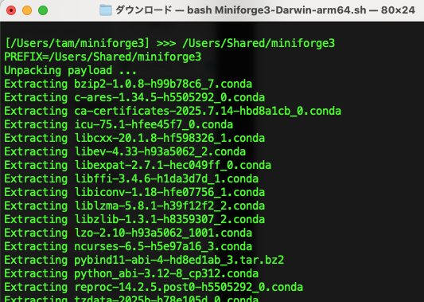

その結果、Macに最初から作られている「共有」フォルダの中に「miniforge3」フォルダが新規作成され、Miniforgeシステムを構成するファイルたち(Pythonなど)がコピーされていきます。


### 4. インストール仕上げ

最後にもうひとつ質問が表示されます。Miniforgeでは`conda`というコマンドを使ってPython環境を管理します。そこで、「あなたのMacのPython系プログラム・アプリはもう全て`conda`の管理に任せますか？」という質問なのです。

```zsh
Transaction finished

installation finished.
Do you wish to update your shell profile to automatically initialize conda?
This will activate conda on startup and change the command prompt when activated.
If you'd prefer that conda's base environment not be activated on startup,
   run the following command when conda is activated:

conda config --set auto_activate_base false

You can undo this by running `conda init --reverse $SHELL`? [yes|no]
[no] >>> 
```

この最後の質問には 「Yes」で対応します。`yes` (すべて半角小文字)とタイプして、`[ENTER]`します。

ターミナルに`Thank you for installing Miniforge3!`と表示されていれば、成功です。**以上の作業で、MiniforgeはみなさんのMacにインストールされました！**

#### 注意

ここまでの作業がうまくいかなかったり、途中でエラーっぽい症状が出て先に進めない場合、miniforgeを再インストールする必要はまったくありません。むしろ悪影響を及ぼす可能性があります。こんなときは、遠慮なく私の研究室までMacを持参してください。すぐに治して使えるようにします。

次は、Miniforgeを用いて、Pythonプログラミング環境の**初期設定**を行っていきます。**ターミナルはまだ使いますので、そのままで！**

## Pythonプログラミング環境の初期設定

### condaコマンドが使えるかどうか確認する

Pythonプログラミング環境を準備したり整えたりするツールが`conda`(コンダ)です。ターミナルで`conda`を使えるかどうか確認します。


実行してもターミナルには特に変化がおきませんが、これによって`conda`コマンドが使えるようになっているはずです。ターミナルに`conda [ENTER]`と入力し、下のような出力が現れることを確認しましょう。

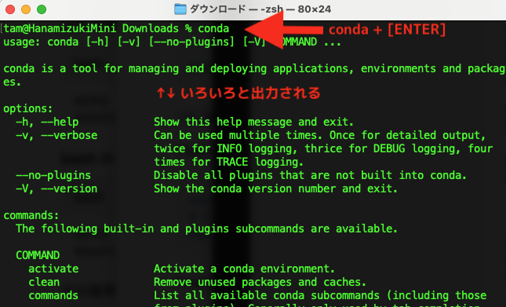

**もしも**、

```zsh
conda: command not found
```

と出力されたら、ターミナルでcondaコマンドが使えないことを意味します。
ターミナルで、次のコマンドを入力します。少し複雑かつ長いコマンドなので、コピペするのが確実です。このコマンドは2行あります(`source ~/.zshrc`が2行目)。2行分コピーして、ちょっと前に実行したターミナルにペースト(貼り付け)を実行します。

```zsh
/Users/Shared/miniforge3/bin/conda init zsh
source ~/.zshrc
```

もう一度`conda [ENTER]`を試して、ちゃんと起動することを確認してください。

### 初期設定1：Miniforgeを最新の内容に更新

さきほどインストールしたMiniforgeには、Pythonの機能を拡張するさまざまなライブラリが入っています。これらは日々、世界中に散在する開発者によって更新されていきます。よって、Miniforgeに含まれているライブラリも、最新のバージョンにしておく方がよいです。

そのために、次のコマンドをターミナルで実行します：

```zsh
conda update -n base conda -y
```

すると、たったいまインストールしたばかりのminiforgeに含まれるパッケージの中で更新されているものを検知し、最新のバージョンを自動的にダウンロード、インストールしてくれます。

下図では、`ca-certificates`というパッケージだけが更新されている様子を表しています。みなさんのMacでは、このコマンドを実行したタイミングの時点で最新のパッケージに更新されるはずです。

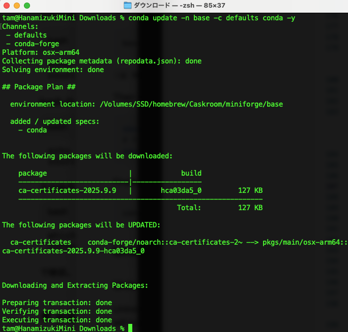

### 初期設定2: 学習・研究用の「仮想環境」を作成する

今回miniforgeの中でインストールしたPythonに加えて、実はMacでは、Appleがカスタマイズした独自のPythonがプレインストールされていて、OSの管理や制御に用いています。このApple独自Pythonを使ってプログラミングすることも不可能ではないですが、データサイエンスに役立つライブラリは入っていません。このApple独自PythonはOSの管理専用としてキープしておき、私たちはノータッチでいきましょう。

その代わり、Miniforgeの中で「使用が完結する」Pythonを使うことになります。このためにMac OSの中に「Miniforgeをベースとした、データサイエンス専用Pythonエコシステム」を構築します。このようなエコシステムを、「**仮想環境**」と呼びます。

#### 仮想環境「ds」の作成

この授業だけでなく、その他のPythonを使う授業や来年度のゼミでの研究活動のために新しい仮想環境を作成します。**新しい仮想環境には名前をつけることができ、名前は何でもよいのですが、短く簡潔に「ds」と命名** します。データサイエンス(**d**ata **s**cience)の略です。Pythonのバージョンは、主要なデータサイエンス・機械学習ライブラリの動作確認がある`3.12`とします。次のコマンドをターミナルで実行してください：

```zsh
conda create -n ds python=3.12 -y
```

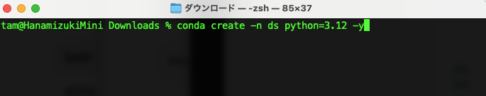

ENTERして実行すると、多くの情報が出力されながら**仮想環境 ds** が作成されます。下図のような画面になったら、作成成功です。

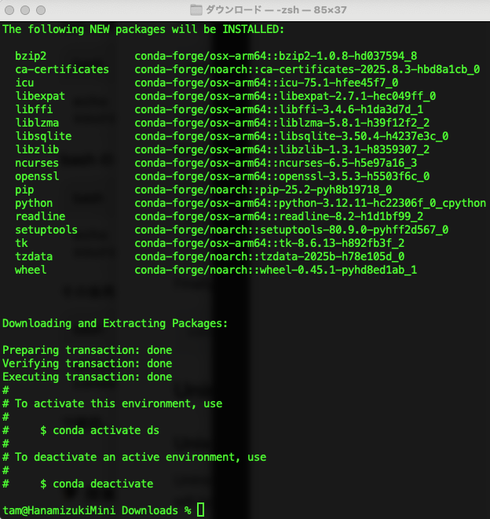

#### 仮想環境「ds」を有効化する

上の画面の最後に指示があるようにターミナルで次のコマンドを実行し、仮想環境 ds を有効化します：

```zsh
conda activate ds
```

ターミナルの入力行の先頭に`(ds)`が追加されます。これは、現在このターミナルは**Pythonの仮想環境「ds」を動かしている**という意味です。


実際に、利用可能なPythonをチェックします。ターミナルに`python --version [ENTER]`と入力してください。

```sh
(ds) ユーザ名@Mac名 Downloads % python --version
Python 3.12.11
```

仮想環境「ds」では、`Python 3.12.XX`(`XX`はバージョン番号)が使えることが分かります。

## 　データサイエンス関連ライブラリをインストールする(Python)

仮想環境「ds」に、この授業やゼミで利用する、データサイエンス定番ライブラリをインストールします。次のコマンドをターミナルで実行してください。

```zsh
conda install -y jupyterlab ipykernel numpy pandas matplotlib seaborn scipy scikit-learn
```

たくさんのライブラリがすごい勢いで一括インストールされる様子を目にすると思います。

* `jupyterlab, ipykernel`：Visual Studio Codeエディタとの連携
* `numpy, pandas`：データ操作ライブラリ
* `matplotlib, seaborn`：グラフ可視化ライブラリ
* `scipy, scikit-learn`：統計・機械学習関連ライブラリ

どのライブラリも世界標準となっているものです。データ分析を行う人なら、学生からプロフェッショナルを問わず、皆使っています。

### グラフの日本語文字化け問題対策パッケージを追加インストール

日本語を操る私たちにとって、世界標準なライブラリを使う際に乗り越えるべき悩みは、グラフの日本語表示の文字化け問題です。日本人の有志の方々が公開している`matplotlib_fontja`というライブラリを導入すれば、その悩みから(ほぼ)解放されます。このライブラリはminiforgeシステムには登録されていないので、次のコマンドをターミナルで実行することで、インストールします。

```zsh
python -m pip install matplotlib_fontja
```

コマンドを実行すると、次のようにダウンロードが自動的に始まり、`matplotlib_fontja`に関連する必須ライブラリも自動的にインストールされていきます：

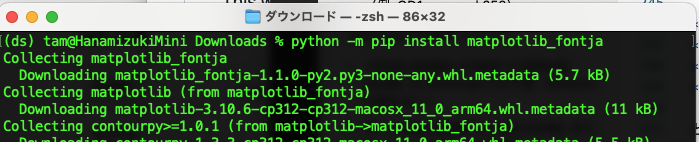

インストールが終わると、ターミナルの出力の下の方に`Succesfully installed ...`というメッセージが表示されます↓

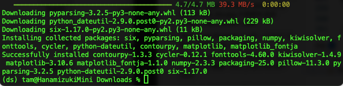

## Jupyter にカーネルを登録

miniforge関連の最後の作業にとりかかります。今はターミナルに色々なコマンドを入力したり、かなり複雑なことをやっていますが、授業や研究ではターミナルはほぼ使わず、VS Codeエディタのみの「シンプルな作業環境」を使います。VS CodeとMiniforge(Python)とRを連携させる仕組みが**jupyter**というライブラリです。jupyterは仮想環境(ds)をVS Codeから直接使う機能を提供します。

**ターミナルが仮想環境dsにいることを確認**し、次のコマンドを実行してください：

```zsh
python -m ipykernel install --user --name ds --display-name "Python(ds)"
```

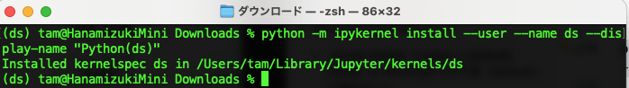

ターミナルの出力に`Installed kernelspec ds in ...`と表示されれば成功です。これは、仮想環境dsをVS Codeで使う準備を行なったというメッセージです。

### ここでブレイク🍵

ここまででおそらく30-40分くらいかかったのではないかと思います。以上でPythonプログラミング環境はほぼ完成です。残りの作業は

1. Rのインストール：RStudio, ExploratoryのようなRを使うアプリを既にインストールしてある場合は、**この作業は不要です**。
2. RをJupyterに登録：全員が作業します。
3. VS Codeのインストール：全員が作業します。
4. 動作確認：PythonもRもVS Codeというひとつの作業環境内で動作する便利さを実感してください。

## 3. R のインストール

**既にRStudioでRを動かしたことがある人は、Rのインストール作業は不要です。 4.Rカーネルの設定に進んでください。**

Mac版 R のインストール方法は、以下のページがとても親切です。ここに書いてある通りの手順で作業を行い、最後の動作確認まで完了してください。

[https://bigdata-analytics.jp/install-tools/install_r_for_mac/](https://bigdata-analytics.jp/install-tools/install_r_for_mac/)

## 4. R カーネルの設定

アプリケーションフォルダの中にあるR.appを起動します。

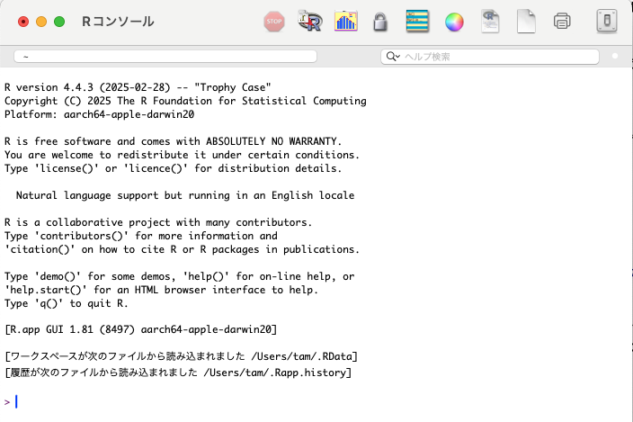

出現したRコンソールに、以下のコマンドを入力（またはコピペ）します。

```r
install.packages("IRkernel")
```

すると、Rコンソールに：

```r
--- Please select a CRAN mirror for use in this session ---
```

というメッセージが表示され、**ダウンロード先のサーバーリスト**一覧が表示された新しいウィンドウが現れることがあります。

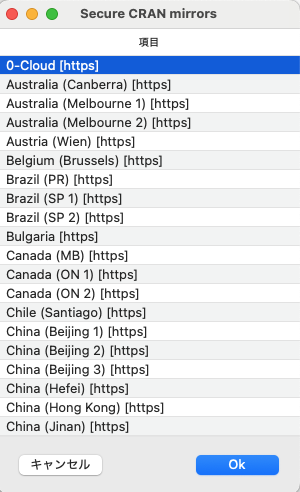

**リスト**の最上部にある`0-Cloud[https]`をマウスで選択して、[OK]ボタンをクリックしればインストール作業が再開されます。インストールはあっという間に終わって下のような画面になります：

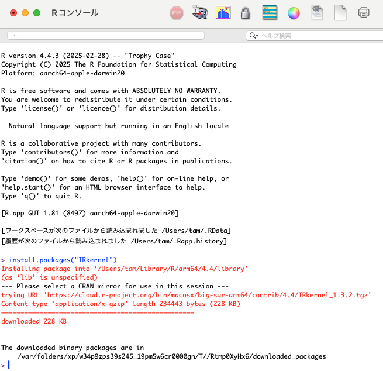

**Rは一旦終了します**(Save Workspace Image？とか聞かれたら、Noを選択します)

### minifogeとRのリンクを確立する

再びターミナル.appに戻ります。もしターミナルを終了していたら、ターミナルを起動して、次のコマンドを実行し、既に作成した仮想環境「ds」に入ります。

```zsh
conda activate ds
```

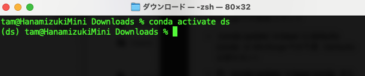

上図のようにターミナルの入力行が `(ds) ユーザー名@Mac名` と表示されていて、先頭に`(ds)`がついていることを確認してください。

ここで、さきほど起動したRの*コマンドバージョン*を起動します。次のコマンドをコピペして実行してください：

```zsh
/Library/Frameworks/R.framework/Resources/bin/R
```

下の画像は、コマンドバージョンのRが起動した状況を表しています。
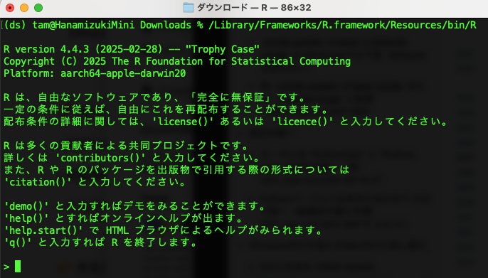

表示されているのは、Rコンソールです。Rコンソールに次の2行をコピペして実行してください。

```R
library(IRkernel)
IRkernel::installspec()
```

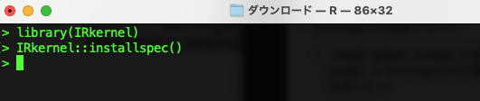

上図のように実行すると、**何も起こりませんがそれでOKです**。むしろエラーっぽい状況が発生したら、私に相談してください。

以上でminiforgeとRのリンクは確立されました。Rを終了しましょう。Rコンソールに`q()[ENTER]`と入力して`Save workspace image? [y/n/c]`と表示されるので、キーボードの`n`を入力すれば、Rは終了します。

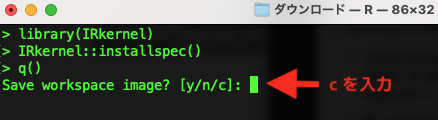

## 5. VS Code のインストール

[https://code.visualstudio.com/](https://code.visualstudio.com/) から VS Code をダウンロードします。SafariやChromeでこのWebサイトを開くと、目立つところに林檎マーク＋Download for macOSというリンクが見えるので、それをクリックしてダウンロードを開始します。

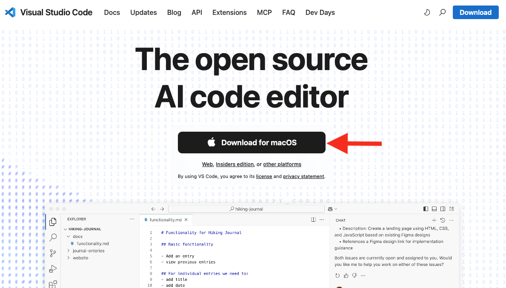

ダウンロードフォルダを開いて、**Visual Studio Code**というアプリを探し出します。これがVS Codeです。これを**アプリケーションフォルダ**にコピーします。

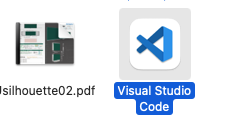

アプリケーションフォルダにコピーした**Visual Studio Code**をダブルクリックして開きます。VS Codeはよく使うエディタになるはずなので、デスクトップのツールバーに登録しておくとよいと思います↓

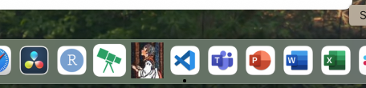

### VS Codeの環境設定

#### VS Codeを日本語化する

VS Codeはデフォルトでは英語表示になっています。ウィンドウ左端の「拡張機能アイコン」をクリックし、検索窓に`japanese`と入力します。すると、**Japanese Language Pack for Visual Studio Code**という拡張機能があります。これはVS Codeの外観やメニューをできる限り日本語表示してくれます。

右下に青字に白文字で「**install**」というボタンがあるので、それをクリックすると、拡張機能がインストールされ、**自動的に再起動して、日本語化された VS Code**が出現します。よく使うメニューや説明が日本語に切り替わります。

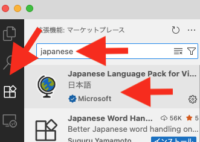

#### Python拡張機能

検索窓に`Python`と入力して下さい。そして出現した拡張機能のうち、次の2つを見つけます

* **Python**：Pythonプログラミングに最適な機能を提供(開発者：Microsoft)
* **Pylance**：Pythonプログラミング文法を自動スペルチェック(開発者：Microsoft)

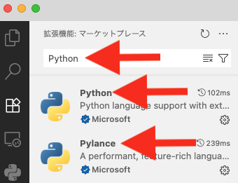

これらも同様に**インストール**します。

#### Jupyter拡張機能

検索窓に`Jupyter`と入力して下さい。そして出現した拡張機能のうち、次の3つを見つけて、**インストール**してください。

* **Jupyter**：Jupyter拡張機能本体 (開発者: Microsoft)
* **Jupyter Keymap**：Jupyter操作にショートカットを提供(開発者：Microsoft)
* **Jupyter Cell Tags**：プログラムにタグをつける(開発者：Microsoft)

### おめでとうございます

以上でPython+Rのプログラミング環境の基本設定は完成です！

VSCodeとターミナルを終了してOKです。
