<!-- _class: lead -->
# Windows11日本語環境での Python & R Jupyter ノートブック環境構築

## 所要時間： 60分

## WindowsノートPCとネット接続

<!-- _header: はじめに -->
## ゴール

* $a_i$
* Miniconda を導入して Python 環境を作成する
* R を導入し、Jupyter から利用可能にする
* VS Code を導入して、Python と R のノートブックを実行できるようにする

---

## 0. 事前準備

* ✅ Windows に管理者権限でログインしているか確認
* ✅ 保存先フォルダを決める（例：`C:\Users\ユーザー名\Documents\ds`）
* ✅ インターネット接続を安定させる

---

## 1. Miniconda のインストール

---

## ブラウザを起動する

アドレスバーに、`miniconda`と入力て検索する
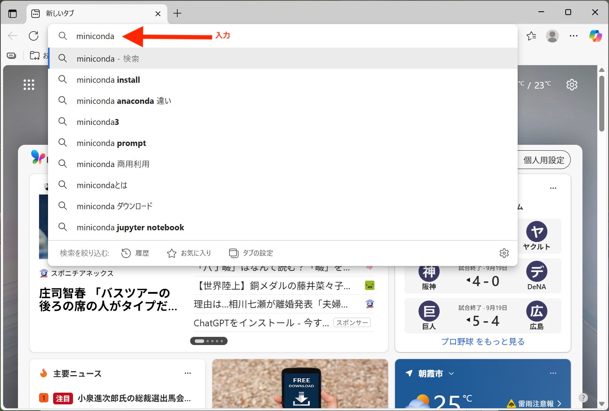

---

## 検索結果を表示

**Miniconda - Anaconda** というリンクを見つけてクリック

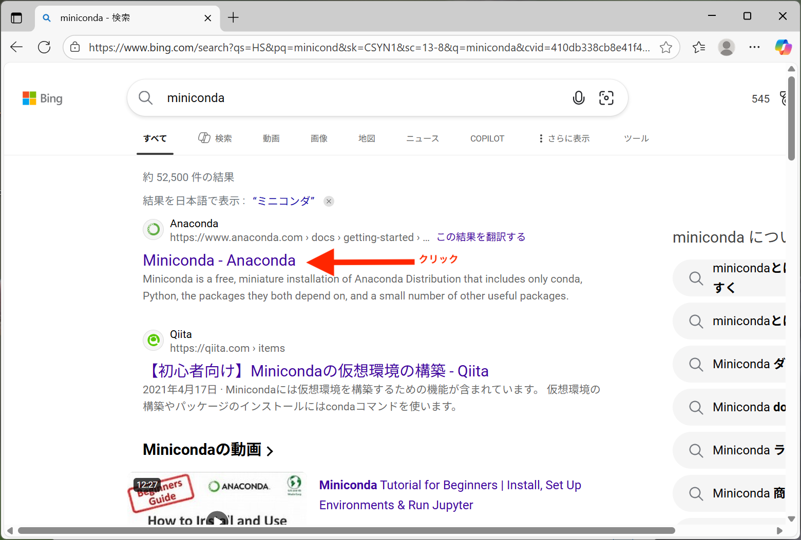

---

## Minicondaページを表示

`クッキー`に関する同意を求められるので、「すべて承諾する」をクリックして、画面右上にある[Download]をクリック

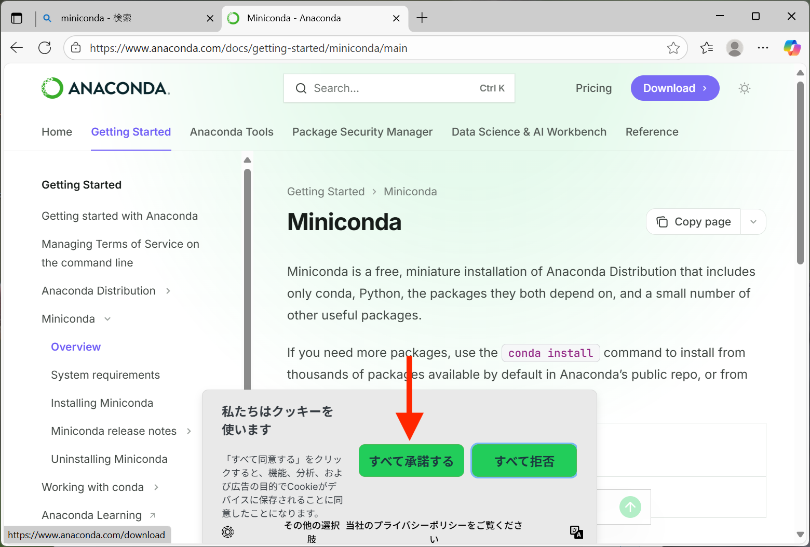

---

## ダウンロード画面

画面右上の[↓Free Download]をクリックすると、**[Get Started]** という緑色のリンクが見えるようになるので、これをクリック


---

## ユーザー登録

続けて自分のメールアドレスを登録する。Gmailを持っている人は、Gmailで簡単にサインアップできる。持っていない人は、大学メールアドレスを使う。いずれにしても、メールアドレスとパスワードを用意しておくこと。


---

## Miniconda インストーラのダウンロード

Windowsユーザーには、Windowsアイコン付きダウンロードリンクが表示されるはずなので、それをクリックする。
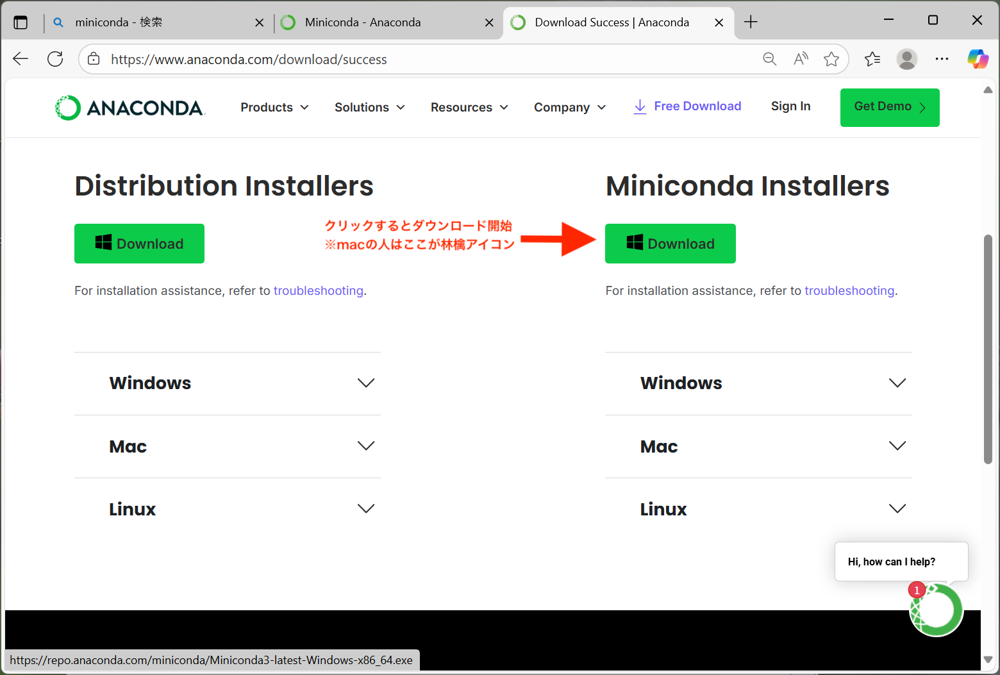

---

## Miniconda インストーラの起動

* 長ったらしい名前のMiniconda インストーラのダウンロードは、いつものようにダウンロードフォルダに保存される。
* ダウンロードが完了したら、ブラウザ上でインストーラをダブルクリックするか、ダウンロードフォルダを開いて、発見したインストーラをダブルクリックする。

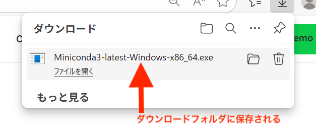

<small>(ファイル名に含まれるバージョン番号はインストールする時期によって変わります)</small>

---

## インストーラの開始

インストーラを起動する。まずは`[Next >]`をクリック


<small>(ファイル名に含まれるバージョン番号はインストールする時期によって変わります)</small>

---

## ライセンス同意画面(英語)

`[I Agree]`を選択

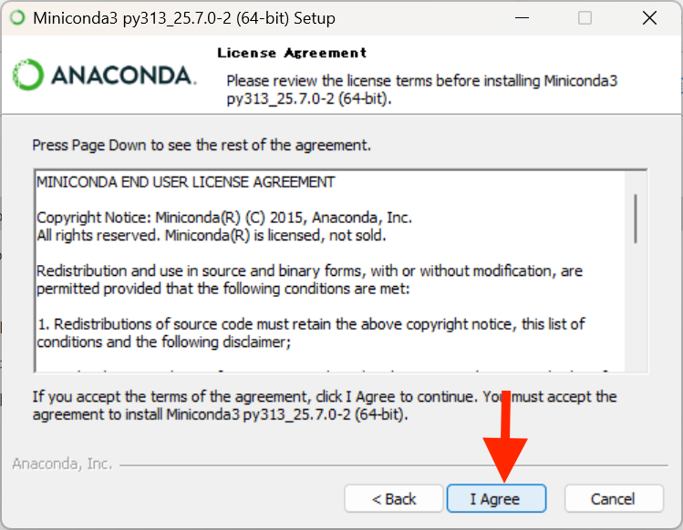

---

## インストール設定1

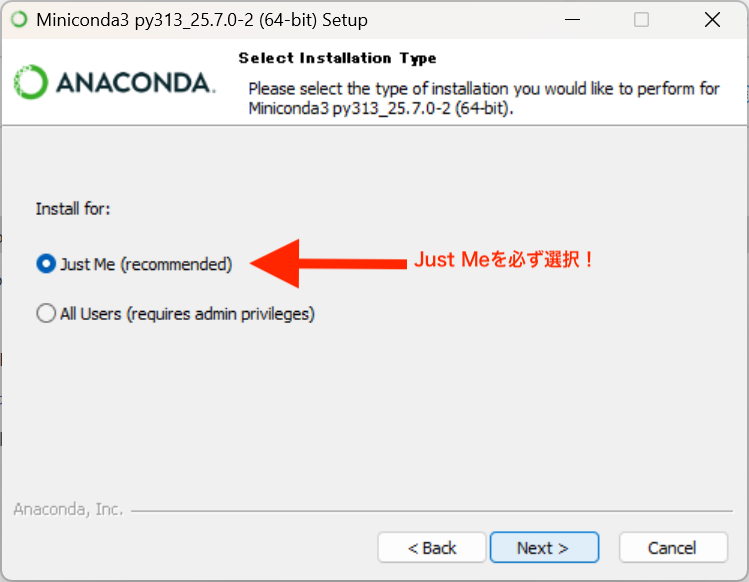

---

## インストール設定2


---

## インストール設定3$\to$インストール開始

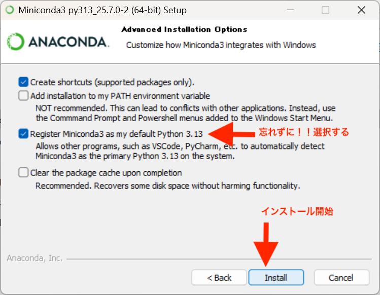

---

## インストール中

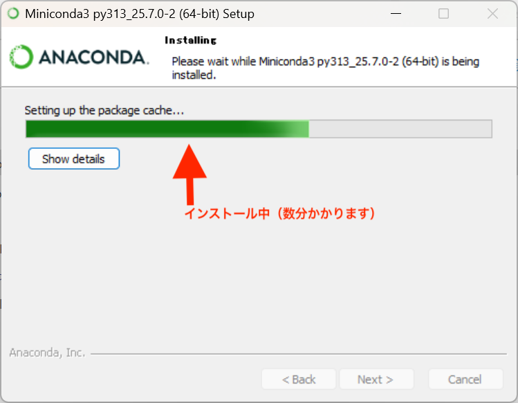

---

## インストール終わり

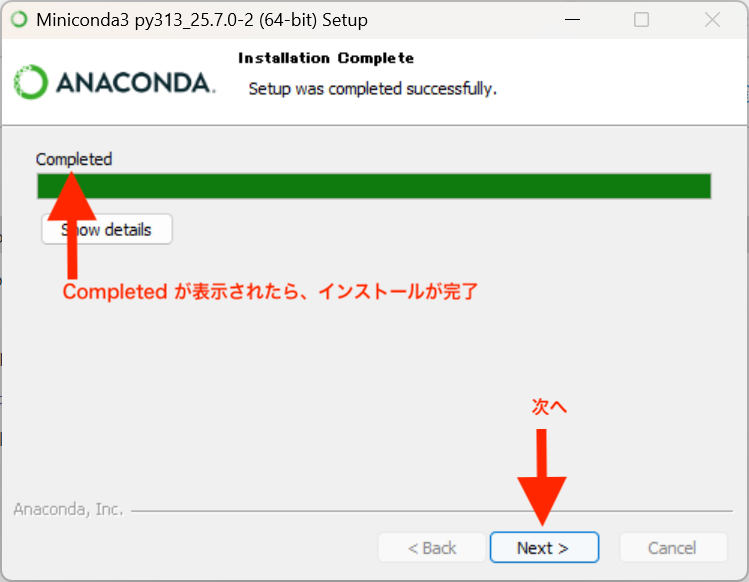

---

## インストーラを終了する

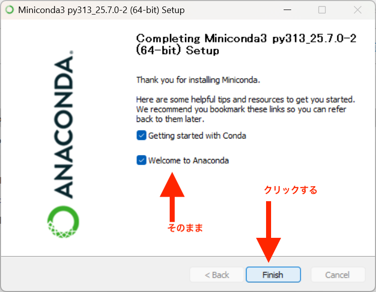

これから**初期設定**を行います。

---

## インストールで使ったブラウザも終了する

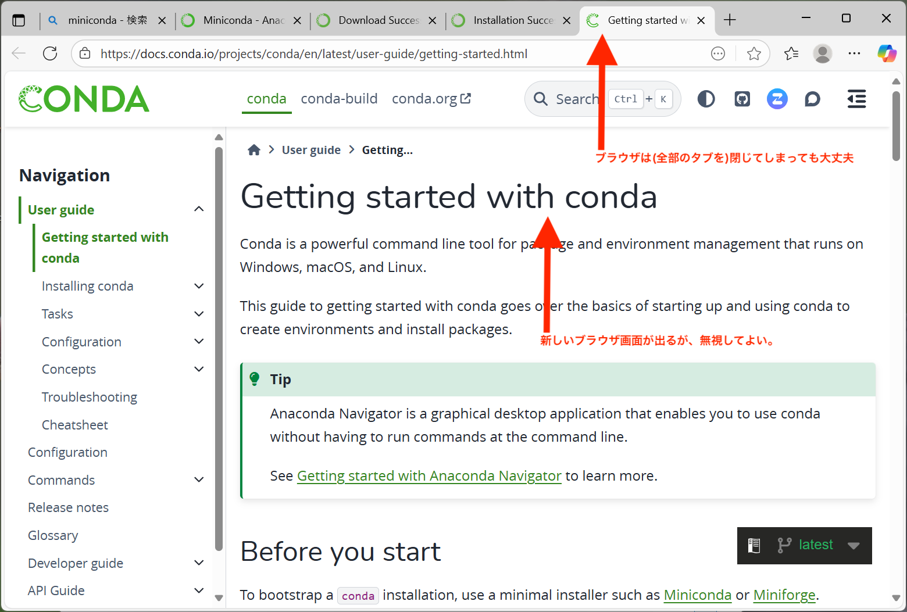

---

## Pythonを利用するための初期設定を開始

インストールが完了したら、VS CodeでPythonを利用するための設定を開始します。アプリ一覧ウィンドウの中から**Anaconda Prompt**を探してこれをクリックします。

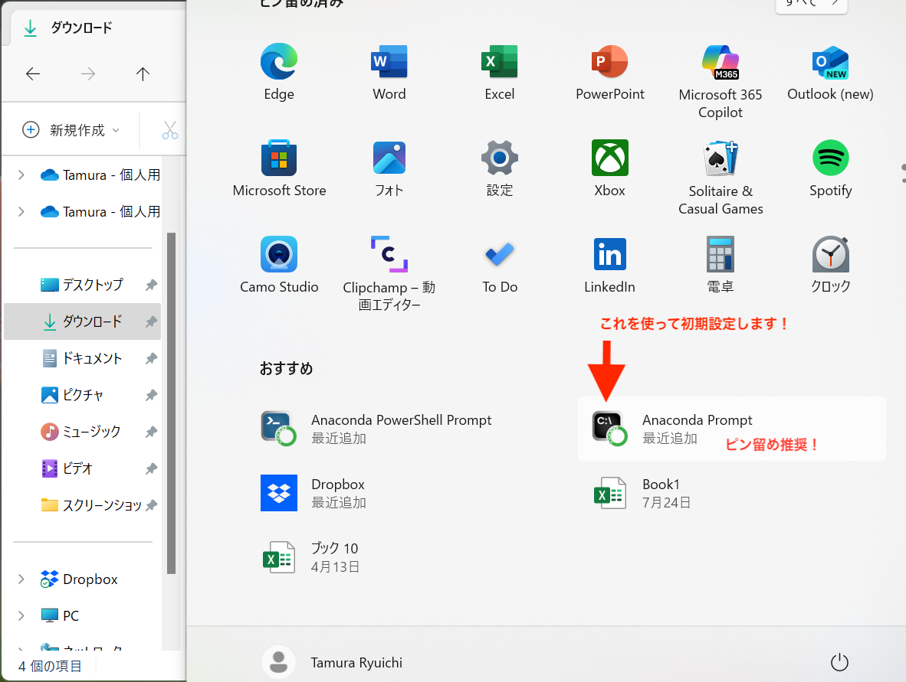

---

## 2. Python 用の環境構築

Anaconda Prompt に以下を入力：

```bat
conda update -n base -c defaults conda -y
conda create -n ds python=3.11 -y
conda activate ds
conda install -y jupyterlab ipykernel numpy pandas matplotlib
```

Jupyter にカーネルを登録：

```bat
python -m ipykernel install --user --name ds --display-name "Python (ds)"
```

---

## 3. R のインストール

1. [CRAN公式サイト](https://cran.r-project.org/bin/windows/base/) から R for Windows をダウンロード
2. 既定値のままインストール

---

## 4. R カーネルの設定

R GUI を起動し、以下を実行：

```r
install.packages("IRkernel")
IRkernel::installspec()
```

→ これで Jupyter に「R」が追加される

---

## 5. VS Code のインストール

1. [公式サイト](https://code.visualstudio.com/) から VS Code をダウンロード
2. インストール時に以下を選択：

   * 「PATH に追加」
   * 「右クリックメニューに追加」

---

## 6. VS Code の拡張機能

VS Code 左の拡張アイコンから以下をインストール：

* **Python**
* **Jupyter**
* **R**

再起動する

---

## 7. Python ノートブックを作る

1. VS Code で学習用フォルダを開く（例：`Documents/ds`）
2. 新規ファイル → `Python入門.ipynb`
3. 右上のカーネル選択 → **Python (ds)** を選択
4. 以下を実行：

```python
import sys, numpy as np, pandas as pd
print("Python:", sys.version.split()[0])
print("NumPy:", np.__version__, "Pandas:", pd.__version__)
```

---

## 8. R ノートブックを作る

1. 新規ファイル → `R入門.ipynb`
2. カーネル選択 → **R** を選択
3. 以下を実行：

```r
sessionInfo()
x <- 1:5
mean(x)
```

---

## 9. ブラウザから JupyterLab を使う場合

Anaconda Prompt で：

```bat
conda activate ds
jupyter lab
```

→ ブラウザで Python (ds) と R のノートブックが選べる

---

## 10. よくあるつまずきと対処

* **カーネルが出ない** → `jupyter kernelspec list` で確認し、再インストール
* **conda コマンドが使えない** → 必ず Anaconda Prompt を利用
* **OneDrive に勝手に保存される** → `C:\ds` などローカル直下を推奨

---

## 11. 授業での運用ヒント

* Python と R を **別ノートブック**で扱う
* 追加パッケージは授業冒頭にインストールセルを提示
* 環境破損時の最小手順：

  1. Miniconda 再インストール
  2. `conda create -n ds python=3.11`
  3. `conda install jupyterlab ipykernel`
  4. `python -m ipykernel install --user --name ds --display-name "Python (ds)"`
  5. R 再インストール → `IRkernel::installspec()`

---

## チェックリスト（学生用）

* [ ] Anaconda Prompt が開ける
* [ ] `conda create -n ds ...` で環境作成できた
* [ ] VS Code に拡張（Python, Jupyter, R）が入っている
* [ ] Python ノートブックが実行できた
* [ ] R ノートブックが実行できた
