# Miniforge + VS Code によるPython/R 環境構築(Windows編)

## はじめに

データサイエンスや機械学習の分野で研究・開発を行うためには、安定したプログラミング環境が欠かせません。
本資料では、次の2つのツールを導入していきます。

* **Miniforge（ミニフォージ）**：
Python の代表的な環境構築ツール conda を、より軽量かつ最新の形で利用できる仕組みです。データ解析や AI 開発に必要なライブラリを簡単に追加でき、さらに Jupyter Notebook（ジュピター） を通じて、コードと文章・図を組み合わせた“実験ノート”を作ることだってできます。
  * [余談だけど重要なこと] これまで世界中の大学では、学生にAnaconda(アナコンダ)という名称の無料の環境構築ツールをインストールするよう指示してきました。ところが2020年くらいから、たとえ大学であっても大人数授業で使う場合は、Anacondaの利用に際して料金を支払うようにライセンスが改悪されてしまいました。それでは困るので、同じような機能かつ*無償利用が保証され、しかもMacではAnacondaよりも動作が早い*、Miniforgeを採用する企業や大学が増えてきています。
* **Visual Studio Code（VS Code／ブイエスコード）**：Microsoft 社が開発する高機能エディタで、Python や R を効率よく書くための便利な機能が豊富にそろっています。世界中の学生・研究者・エンジニアに利用されており、プログラミング学習から実務まで幅広く活用できます。当然、無料で使うことができます。

これらを組み合わせて使うことで、授業や研究だけでなく、業界でも通用する「プロフェッショナルな作業環境」を自分のPCに整えることができます。

下図が環境のイメージです。

* JupyterとPythonに関しては、Miniforgeが常にきちんと動くように面倒を見てくれる
* Visual Studio Codeの中で、プログラムを書いて、Jupyter経由でPythonとRに実行させる


1回この環境を完成させれば、卒業まで困ることはありません。頑張ってまいりましょう。ひとつだけ注意点をお伝えします。

ここで行う作業の後半では、「半角文字でコマンドを入力する」という慣れない操作を行うことがあります。この操作は煩雑に見えますが、最も簡単なやり方は、書かれいてるコマンドを慎重に選択→コピーして、ペーストする(貼り付ける)ことです。コピーとペーストはマウスやタッチバッドのの右クリックで実行できます。

## インストール作業を始める前の準備

### 準備1：インストール先フォルダを作る

Windowsでは通常クラウド同期機能の「One Drive」が動いています。また、ユーザー名に日本語や空白が含まれていることもあります。これらはインストール作業で原因不明のエラーの原因となります。

授業や研究などで、このような面倒かつ不明な障害を出来るだけ回避するため、これから**MiniforgeをWindowsのルート(`C:¥`)直下に新しく作ったフォルダの中にインストールしていきます**。その方法を説明します。

Windowsの画面下にある「🔍検索」フィールドに、半角小文字で `e` と入力し、表示された候補の中から、**エクスプローラ Explorer** をクリックして起動します。

エクスプローラの左側に多くの項目がありますが、下の方に`🖥️ PC`という項目とアイコンがあります。これをクリックします。

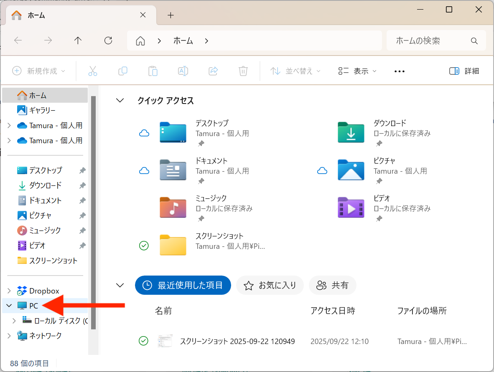

すると、右側の広いウィンドウに「ローカルディスク (C:)」というのが出現するはずです。ここはWindowsシステムやアプリ、ユーザー領域といったすべてのハードディスクの内容が保存されている「ルートフォルダ」と呼ばれているもので、「**Cドライブ**」と呼称することもあります。

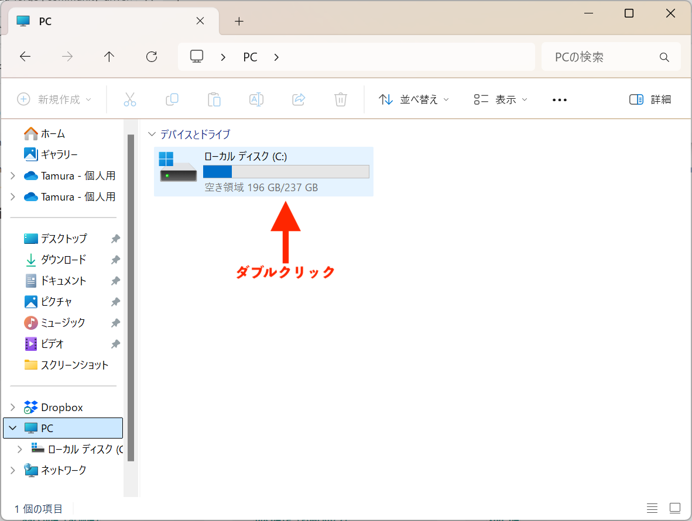

これを**ダブルクリック**すると、`C`の中に含まれるフォルダ一覧が表示されます。何も表示されていない領域にマウスを移動して右クリックし、「**新規作成 → フォルダ**」を選びます。

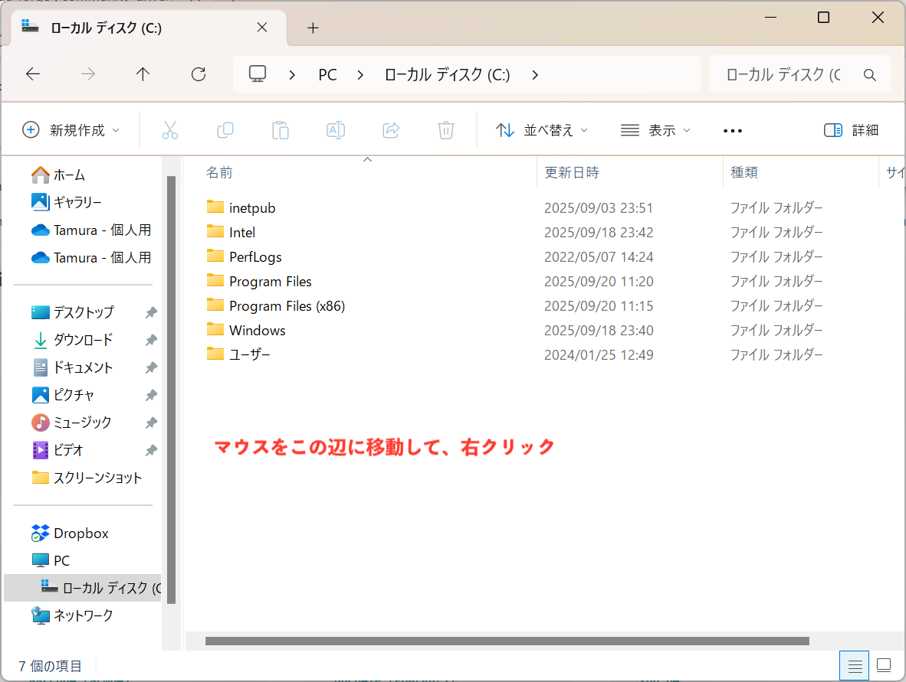

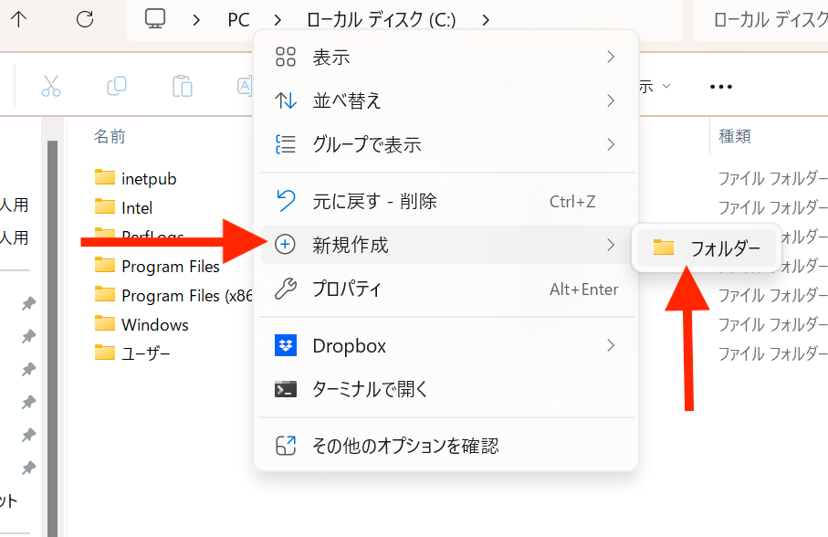

新しく作成されたフォルダが、インストール先になります。次の名前を入力してください：

```bat
miniforge3
```

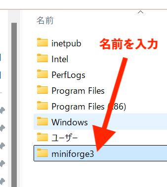

すぐ後の作業で、新しく作ったこのフォルダ`miniforge3`にMiniforgeをインストールしていくので、確実に作ってください。

**以上で準備は完了です！**

## Miniforge3のインストール

### 1. インストーラーのダウンロード

SafariやChromeなどで、MiniforgeのWebサイト：
[https://conda-forge.org/download/](https://conda-forge.org/download/)にアクセスします。WindowsのアイコンのあるWindows用Miniforgeインストーラーをクリックしてダウンロードしてください。

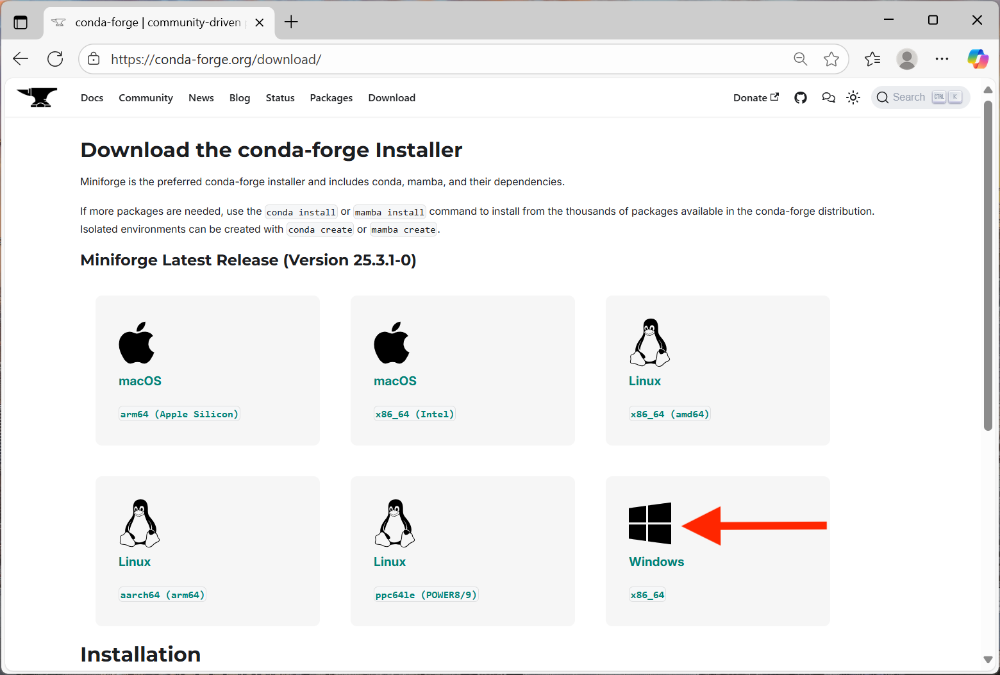

#### ダウンロードのときのセキュリティ問題に対処する

最近のWindowsでは、あまり有名でないMiniforgeインストーラーをダウンロードすると、Windows Defender(Windowsが使うセキュリティ保護アプリ)が「このインストーラーは信頼できないので実行させません」などと強権を行使して妨害してくることがあります：

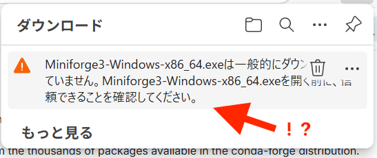

このままだとMiniforgeをインストールできないので、次の手順で対処します。

STEP 1: 上の画像で右端にある「$\cdots$」という部分をクリックしてください。

STEP 2: 出現したウィンドウメニューの中から、**保存**を選択します。

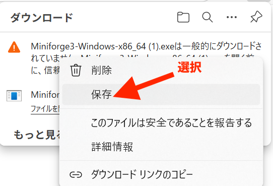

STEP 3：すると、信頼できることを確認してくださいとかなんとか警告するウィンドウが現れるので、**削除**ボタンの下向き矢印をクリックして、「**保持する**」を選択します。

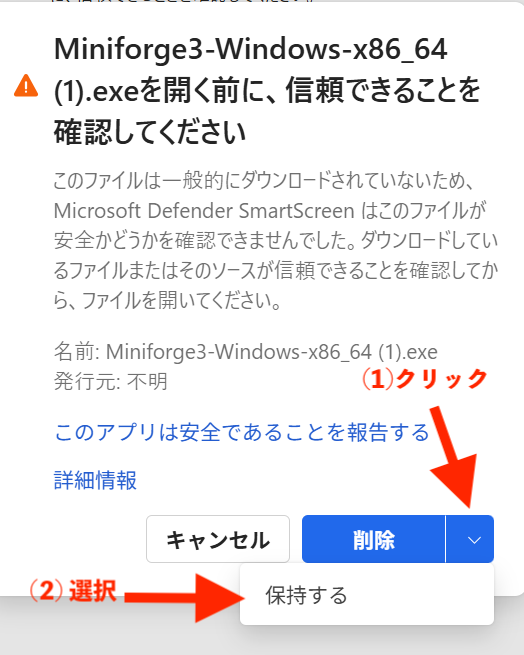

STEP 4：これで警告は消え、Miniforgeインストーラーが使えるようになりました。**ファイルを開く**をクリックして、インストーラーを起動します（少々時間がかかります）。

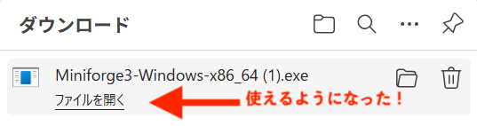

### 2. インストール作業開始

Miniforgeインストーラーが起動したら、`[Next >]`をクリックします。

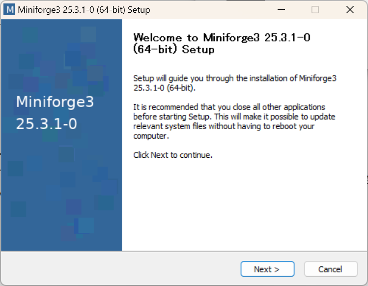

次のライセンス同意画面では、`[I Agree]`をクリックします。

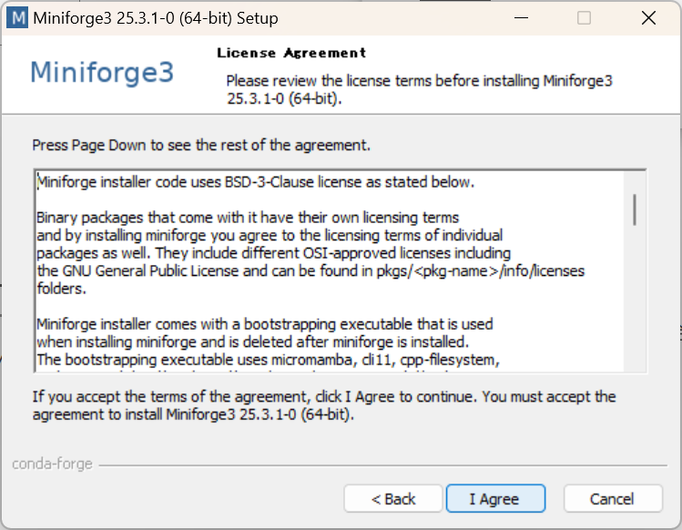

次の画面では、`Just Me (recommended)`にチェックが入っていることを確認して`[Next >]`をクリックします。

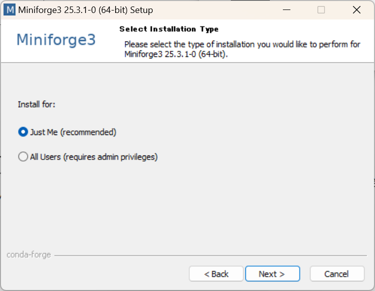

次の画面で、先ほど作成したインストール先フォルダを設定します(下図も参照)。`Destination Folder`に書かれている場所がインストール先フォルダの規定値ですが、日本語PCではトラブルが頻出してますので、変更します。`[Brouwse]`ボタンをクリックします。

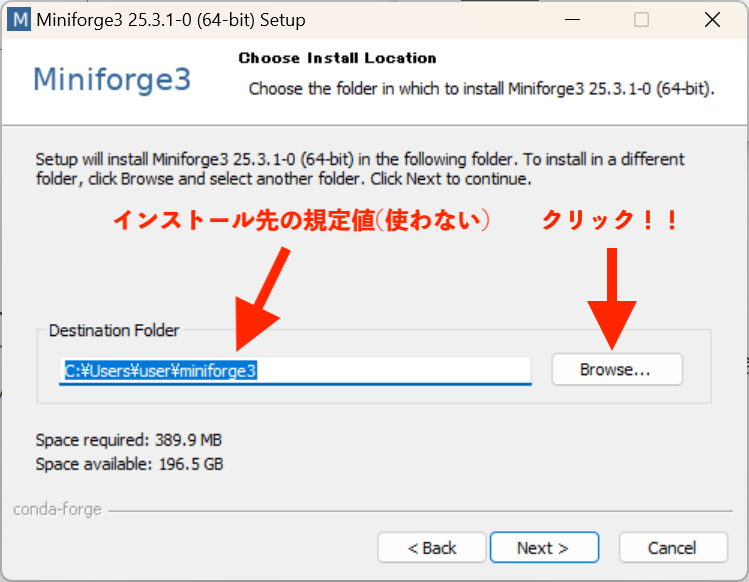

`[Browse]`をクリックすると、手動でインストール先フォルダを選択するよう求められます。先ほど作成した、`miniforge3`というフォルダが`ローカルディスク(C)`の下にあるはずなので、それをマウスで選択して、[OK]をクリックします（下図も参照）。

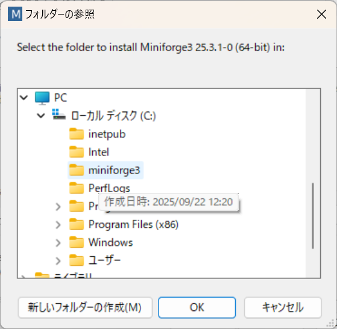

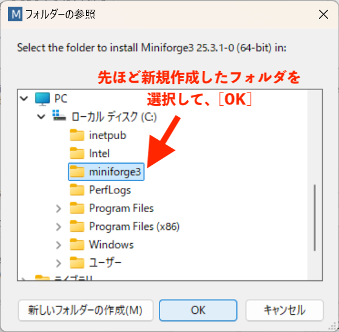

設定を終えると、Destination Folderが`C:¥miniforge3¥`に変更されているはずです。

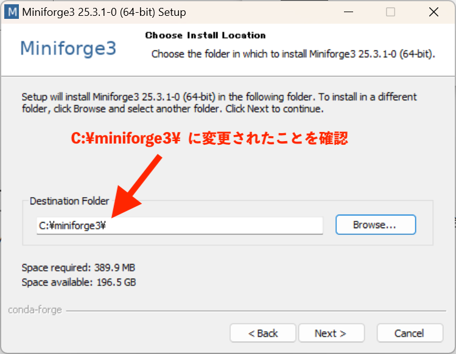

設定が変更されているのを確認したら、`[Next >]`をクリックします。

次に現れる画面は、Windowsインストール時のオプション機能です。下図に示したように、1・3・4番目のオプションにチェックを入れてください(**必須**。そして2番目には絶対チェックをいれない)。

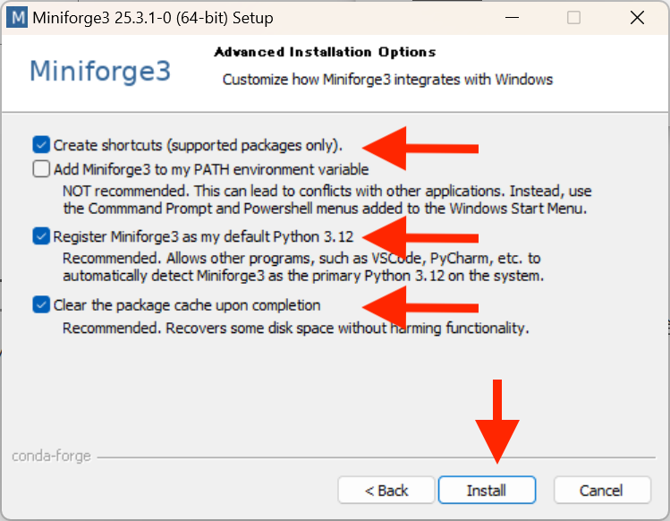

`[Install]`をクリックして、インストールを開始します。

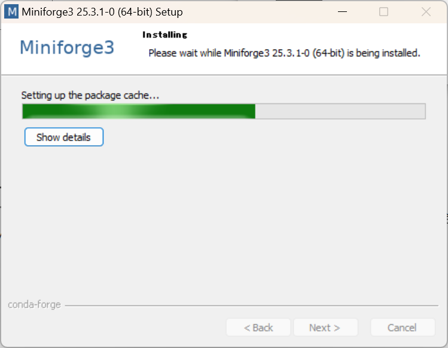

インストールには5-10分程度かかります。以下の2つの画像のようなウィンドウが表示されれば、インストールは完了です。

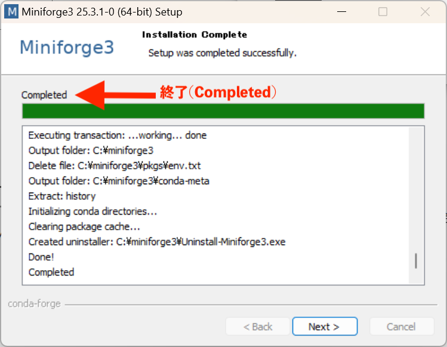

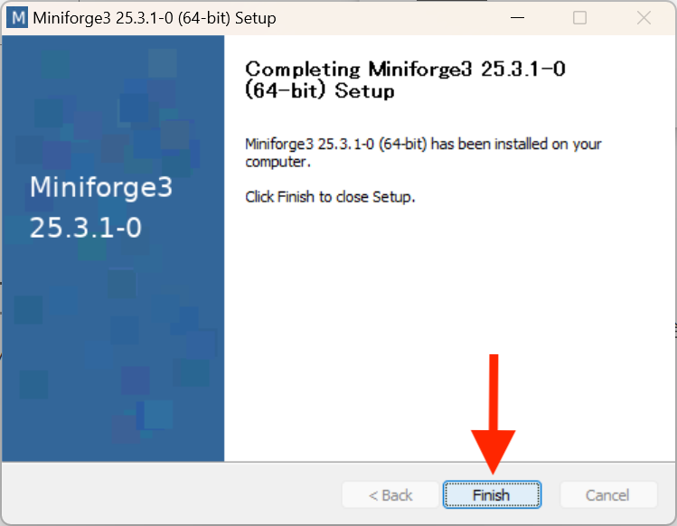

**以上の作業で、MiniforgeはみなさんのWindowsにインストールされました！**

#### 注意

ここまでの作業がうまくいかなかったり、途中でエラーっぽい症状が出て先に進めない場合、遠慮なく私の研究室までPCを持参してください。すぐに治して使えるようにします。

次は、Miniforgeを用いて、Pythonプログラミング環境の**初期設定**を行っていきます。

## Pythonプログラミング環境の初期設定

Miniforgeシステムをデータサイエンスに適したようにカスタマイズするには、**Miniforgeプロンプト**(以下、単に"**プロンプト**"と**略称**する)という、Windowsのコマンドプロンプトと外見の似たアプリを使います。このアプリを使ってプログラミング環境を整えていきます。

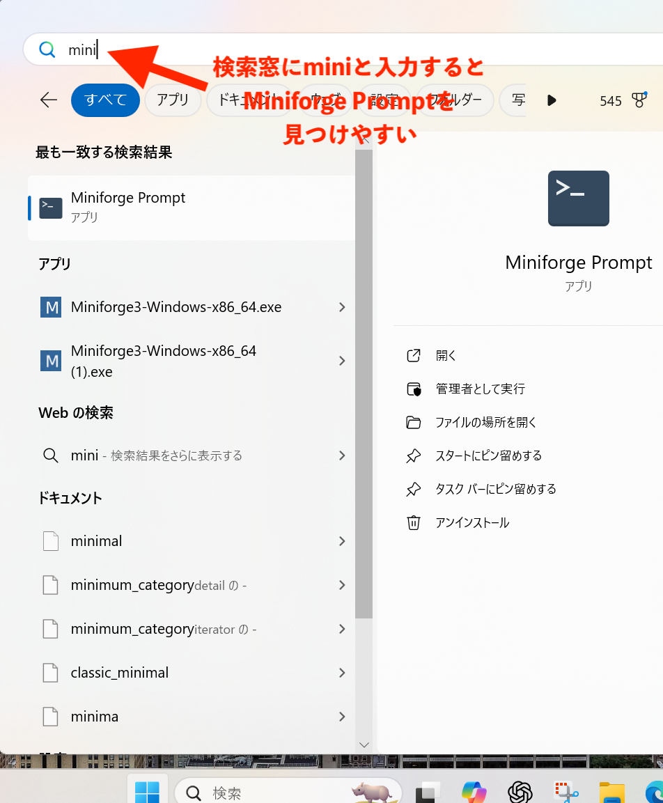

### conda コマンドを使えるようにする

プロンプト上で動作し、Pythonプログラミング環境で必要なライブラリ・パッケージ群を準備したり整えたりするツールが`conda`(コンダ)です。

プロンプトに`conda [ENTER]`と入力し、プロンプトに下のようなメッセージが出力されることを確認しましょう。

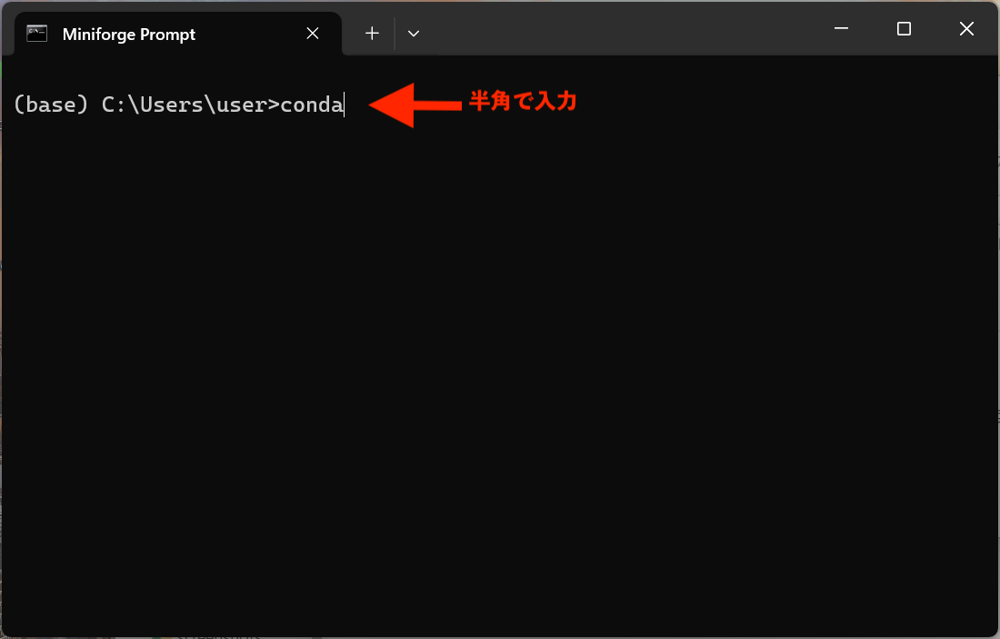
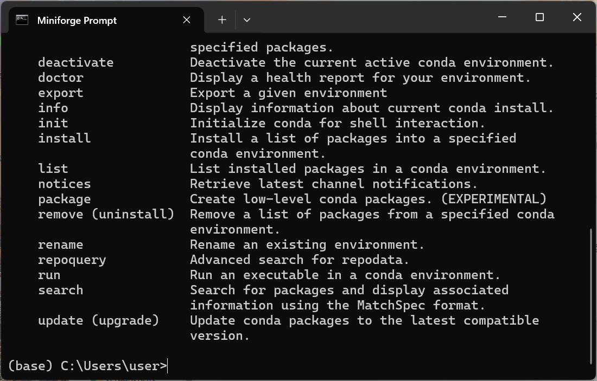

### 初期設定1：Miniforgeを最新の内容に更新

さきほどインストールしたMiniforgeには、Pythonの機能を拡張するさまざまなライブラリが入っています。これらは日々、世界中に散在する開発者によって更新されていきます。よって、Miniforgeに含まれているライブラリも、最新のバージョンにしておく方がよいです。

そのために、次のコマンドをターミナルで実行します：

```bat
conda update -n base conda -y
```

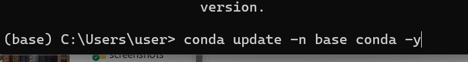

すると、たったいまインストールしたばかりのminiforgeに含まれるパッケージの中で更新されているものを検知し、最新のバージョンを自動的にダウンロード、インストールしてくれます。インストールには数分かかり、その間さまざまな出力がMiniforge プロンプトを流れていきますが、アップデート作業が全部終わると、画面がクリーンアップされ、`done`という表示がプロンプト最上部に表示されるはずです。

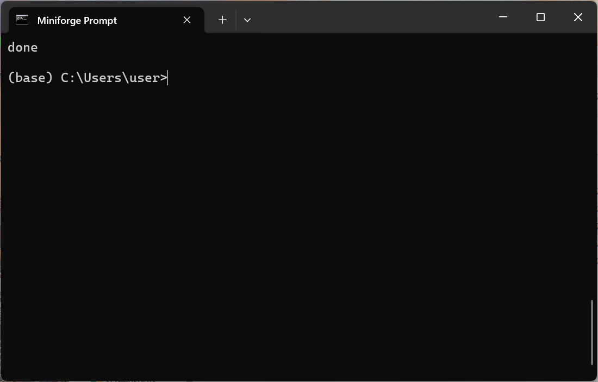

### 初期設定2: 学習・研究用の「仮想環境」を作成する

Miniforgeでは、Pythonの実行環境を「**仮想環境**」という"Pythonの利用が完結するエコシステム"単位で管理します。Miniforgeプロンプトの入力部に`(base)`というのが見えます。これはMiniforgeがインストールされたときに自動的に作成する"基本的な"仮想環境です。現在Miniforgeプロンプトは、Pythonの`base`という仮想環境の中で動いているのです。`base`は、Miniforgeシステムの中で管理者的役割を担っている仮想環境です。

私たちはデータ分析などの用途にPython環境を整えていくわけですが、こんなときは新たに専用の仮想環境を作ることが奨励されています。

#### 仮想環境「ds」の作成

この授業だけでなく、その他のPythonを使う授業や来年度のゼミでの研究活動のために、新しい仮想環境を作成します。**新しい仮想環境には名前をつけることができ、名前は何でもよいのですが、短く簡潔に「ds」と命名** します。データサイエンス(**d**ata **s**cience)の略です。Pythonのバージョンは、主要なデータサイエンス・機械学習ライブラリの動作確認がある`3.12`とします。次のコマンドをプロンプトで実行してください：

```bat
conda create -n ds python=3.12 -y
```

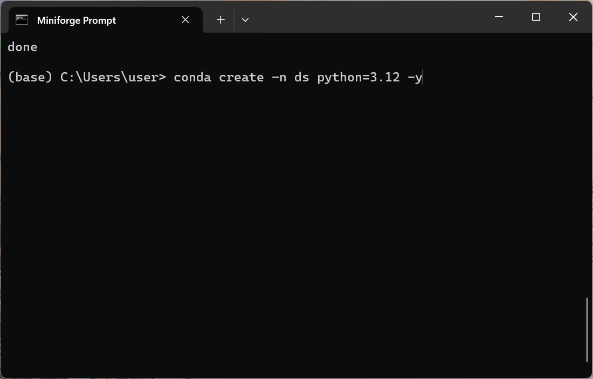

ENTERして実行すると、多くの情報が出力されながら**仮想環境 ds** が作成されます。下図のような画面になったら、作成成功です。

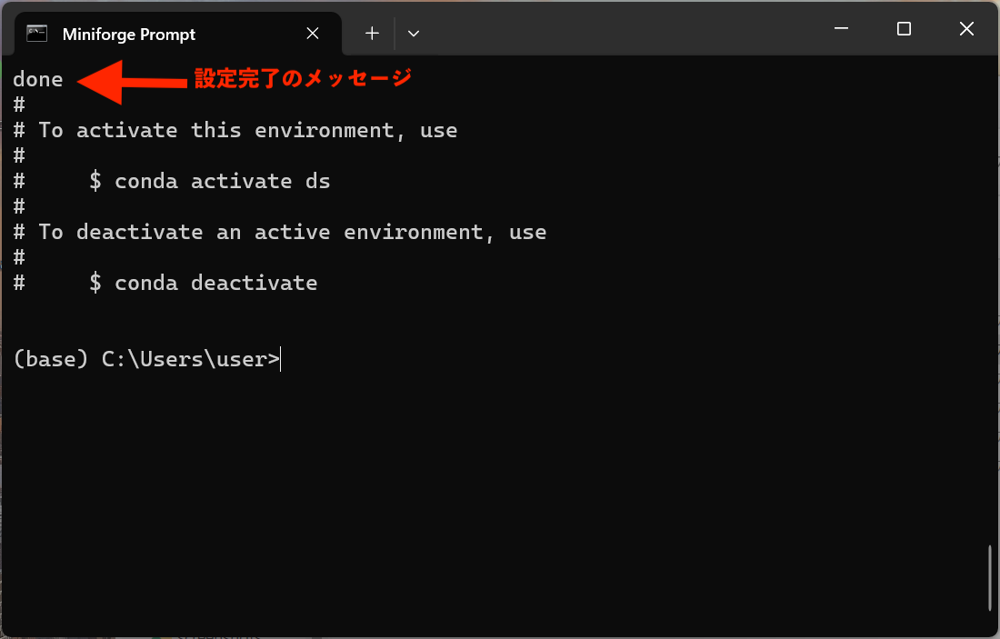

#### 仮想環境「ds」を有効化する

上の画面の最後に指示があるようにプロンプトで次のコマンドを実行し、仮想環境 ds を有効化します：

```zsh
conda activate ds
```

プロンプトの入力行の先頭に`(ds)`が追加されます。現在このプロンプトは**Pythonの仮想環境「ds」を動かしている**という意味です。

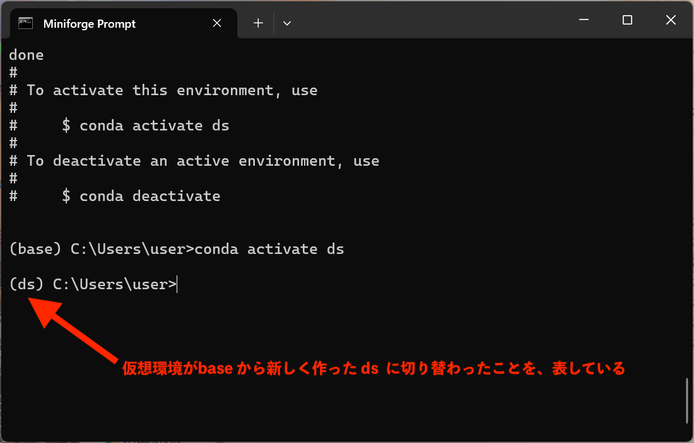

実際に、利用可能なPythonをチェックします。プロンプトに`python --version [ENTER]`と入力してください。

```sh
(ds) ユーザ名@Mac名 Downloads % python --version
Python 3.12.11
```

仮想環境「ds」では、`Python 3.12.XX`(`XX`はバージョン番号)が使えることが分かります。

## 　データサイエンス関連ライブラリをインストールする(Python)

仮想環境「ds」に、この授業やゼミで利用する、データサイエンス定番ライブラリをインストールします。次のコマンドをターミナルで実行してください。

```zsh
conda install -y jupyterlab ipykernel numpy pandas matplotlib seaborn scipy scikit-learn
```

たくさんのライブラリがすごい勢いで一括インストールされる様子を目にすると思います。終了まで10分程度かかります。プロンプトに`done`(終了)というメッセージが表示されれば終わりです。ちなみにインストールしたのは、世界標準かつデータ分析を行う人なら、学生からプロフェッショナルを問わず、皆使っている有名なPythonライブラリです。

* `jupyterlab, ipykernel`：Visual Studio Codeエディタとの連携
* `numpy, pandas`：データ操作ライブラリ
* `matplotlib, seaborn`：グラフ可視化ライブラリ
* `scipy, scikit-learn`：統計・機械学習関連ライブラリ

### グラフの日本語文字化け問題対策パッケージを追加インストール

日本語を操る私たちにとって、世界標準なライブラリを使う際に乗り越えるべき悩みは、グラフの日本語表示の文字化け問題です。日本人の有志の方々が公開している`matplotlib_fontja`というライブラリを導入すれば、その悩みから(ほぼ)解放されます。このライブラリはminiforgeシステムには登録されていないので、次のコマンドをターミナルで実行することで、インストールします。

```zsh
python -m pip install matplotlib_fontja
```

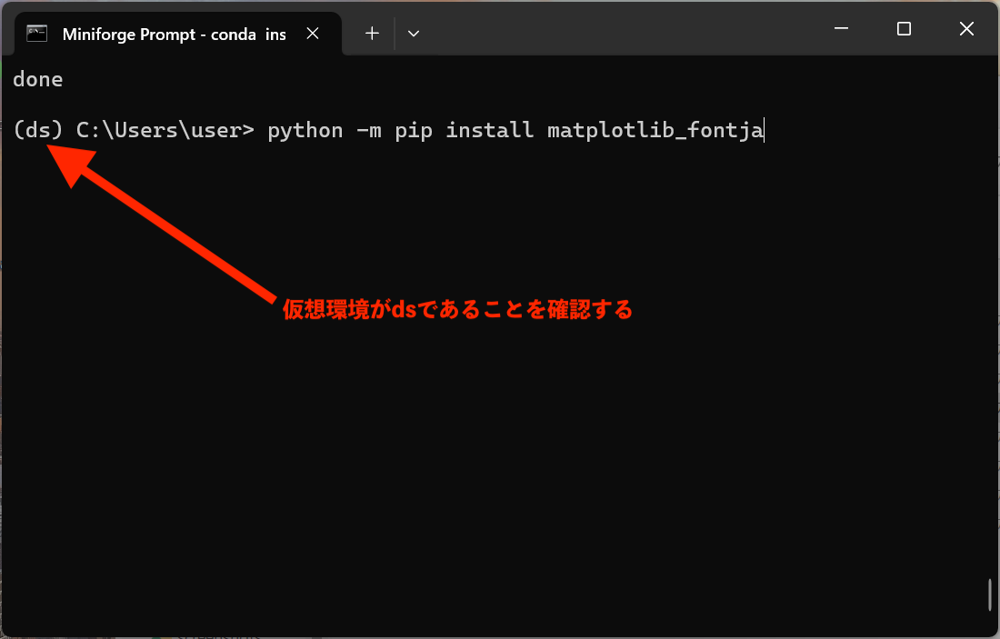

コマンドを実行すると、次のようにダウンロードが自動的に始まり、`matplotlib_fontja`に関連する必須ライブラリも自動的にインストールされていきます：

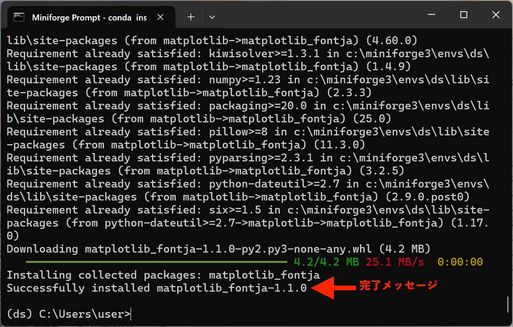

インストールが終わると、ターミナルの出力の下の方に`Succesfully installed ...`というメッセージが表示されます。

## Jupyter にカーネルを登録

miniforge関連の最後の作業にとりかかります。今はプロンプトに色々なコマンドを入力したり、かなり複雑なことをやっていますが、授業や研究ではプロンプトはほぼ使わず、VS Codeエディタのみの「シンプルな作業環境」を使います。VS CodeとMiniforge(Python)とRを連携させる仕組みが**jupyter**というライブラリです。jupyterは仮想環境(ds)をVS Codeから直接使う機能を提供します。

**ターミナルが仮想環境dsにいることを確認**し、次のコマンドを実行してください：

```zsh
python -m ipykernel install --user --name ds --display-name "Python(ds)"
```

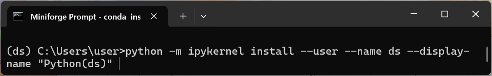

ターミナルの出力に`Installed kernelspec ds in ...`と表示されれば成功です。これは、仮想環境dsをVS Codeで使う準備を行なったというメッセージです。

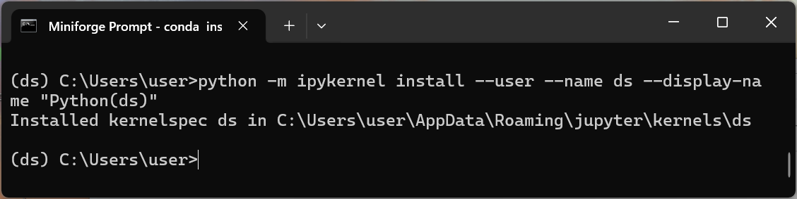

### ここでブレイク🍵

ここまででおそらく30-40分くらいかかったのではないかと思います。以上でPythonプログラミング環境はほぼ完成です。残りの作業は

1. Rのインストール：RStudio, ExploratoryのようなRを使うアプリを既にインストールしてある場合は、**この作業は不要です**。
2. RをJupyterに登録：全員が作業します。
3. VS Codeのインストール：全員が作業します。
4. 動作確認：PythonもRもVS Codeというひとつの作業環境内で動作する便利さを実感してください。

## 3. R のインストール

**既にRStudioでRを動かしたことがある人は、Rのインストール作業は不要です。 4.Rカーネルの設定に進んでください。**

Mac版 R のインストール方法は、以下のページがとても親切です。ここに書いてある通りの手順で作業を行い、最後の動作確認まで完了してください。

[https://bigdata-analytics.jp/install-tools/install_r_for_mac/](https://bigdata-analytics.jp/install-tools/install_r_for_mac/)

## 4. R カーネルの設定

スタートボタンからRを起動します。

**注意1: Rstudioではありません。`R X.Y.Z`(X,Y,Zはバージョン番号)という名前のアプリです。見つからない場合は、下図のようにスタートボタンの検索で`R`と入力すれば出てきます。**

**注意2: Rのバージョン番号は、お使いのPCによって異なります。ある人は`R 4.3.3`かもしれないし、別の人は`R 4.5.0`かもしれません。**検索して複数ヒットした場合は、新しいバージョン番号の R を選択しましょう**。

**注意3：起動したRのバージョン(`X.Y.Z`)を忘れずに覚えておいてください。下図ではR-4.5.1を起動しています。この情報はすぐ後で使います**

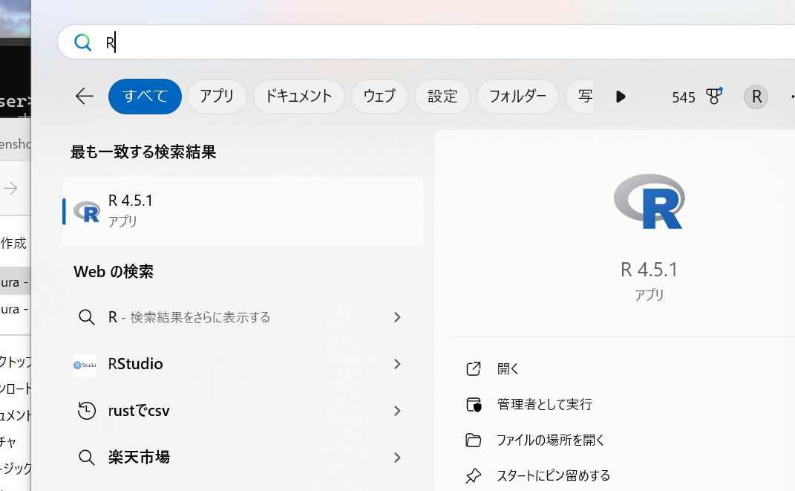

出現したRコンソールに、以下のコマンドを入力（またはコピペ）します。

```r
install.packages("IRkernel")
```

もしこのRアプリを初めて起動した人は、次のようなメッセージが出ます。

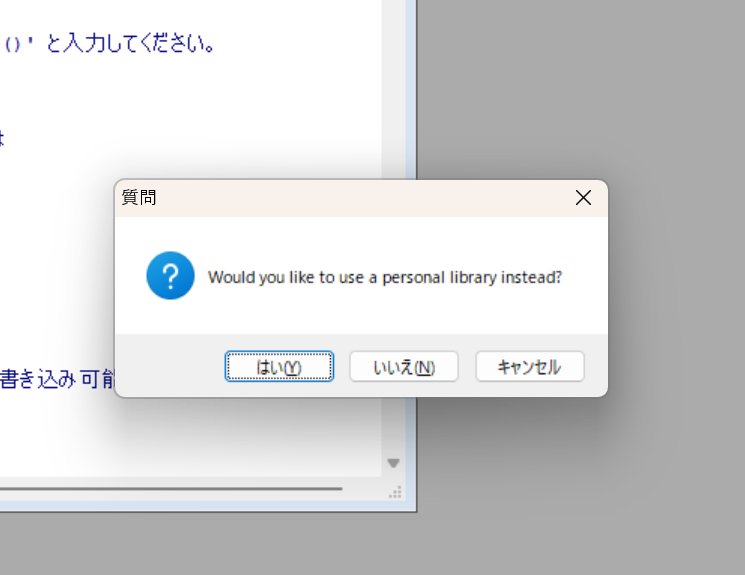

これは「外部ライブラリをネットからダウンロードしてインストールための、個人的なライブラリ置き場を設定してもよいか」という意味です。`[はい(Y)]`を選択します。さらに(なぜか)同じ主旨のメッセージダイアログが日本語でも出現することがあります。

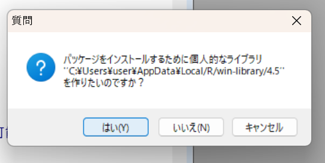

ここでも同様に`[はい(Y)]`を選択します。

すると、Rコンソールに：

```r
--- Please select a CRAN mirror for use in this session ---
```

というメッセージが表示され、**ダウンロード先のサーバーリスト**一覧が表示された新しいウィンドウが現れることがあります。

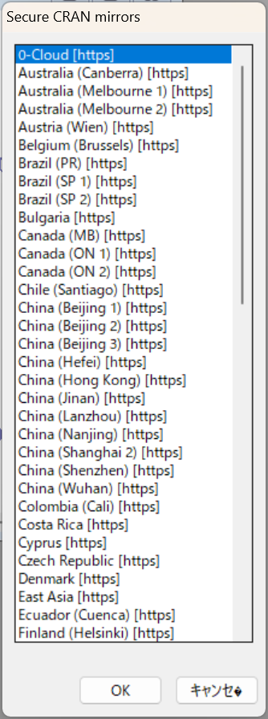

**リスト**の最上部にある`0-Cloud[https]`をマウスで選択して、[OK]ボタンをクリックしればインストール作業が再開されます。インストールに少々時間がかかって、下のような画面になればOKです。

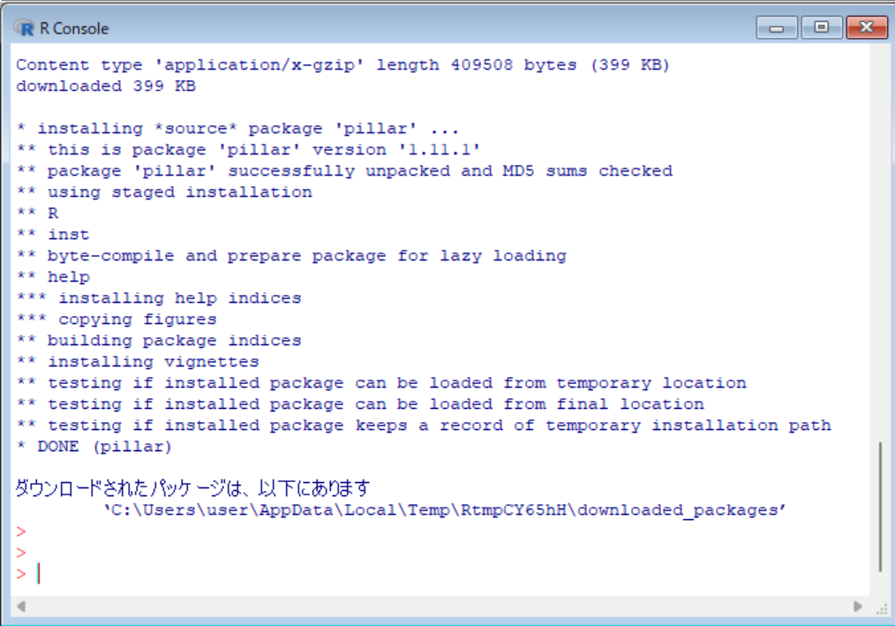

**Rは一旦終了します**(作業スペースを保存しますか？とか聞かれたら、`[いいえ(N)]`を選択します)

### minifogeとRのリンクを確立する

再びMiniforgeプロンプトに戻ります。**もしMiniforgeプロンプトを終了していたら**、慌てずMiniforgeプロンプトをもう一度起動して、次のコマンドを実行し、**既に作成した仮想環境「ds」に入ります**。

```bat
conda activate ds
```

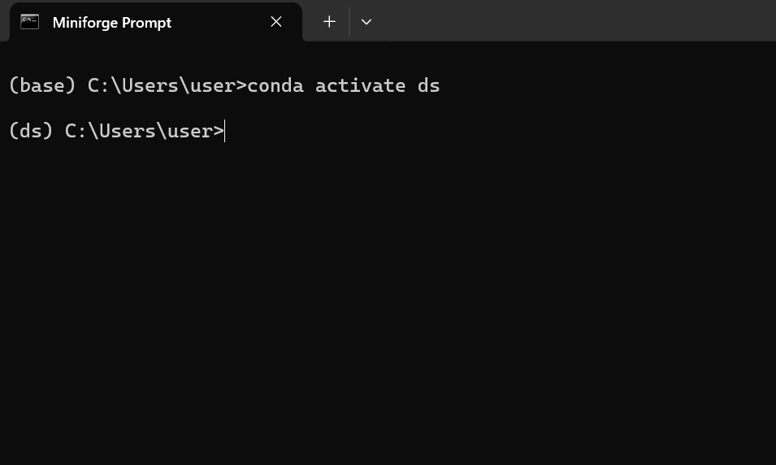

さて、ここからとても大事な作業です。**仮想環境 dsからさきほどRカーネルをインストールしたRのバージョンにリンクを貼ります。** そのためには、いま使っているMiniforgeプロンプト上で、さきほどのRを実行しないといけません。

Rのバージョン番号(3つ; それぞれ仮に`X`,`Y`,`Z`とします)の情報を用いて、プロンプトに次のコマンドを入力します。

```bat
"c:\Program Files\R\R-X.Y.Z\bin\x64\R.exe"
```

`R-4.4.3`ならば：

```bat
"c:\Program Files\R\R-4.4.3\bin\x64\R.exe"
```

`R-4.5.0`ならば：

```bat
"c:\Program Files\R\R-4.5.0\bin\x64\R.exe"
```

というコマンドをプロンプトに入力します。注意：コマンドの先頭と末尾の二重引用符`"`は**必ずつけてください**

下図の先頭行にその状況が示されています。ここでは`R-4.5.1`のRコンソールを、**仮想環境ds上で起動**しています(ここがポイント)。

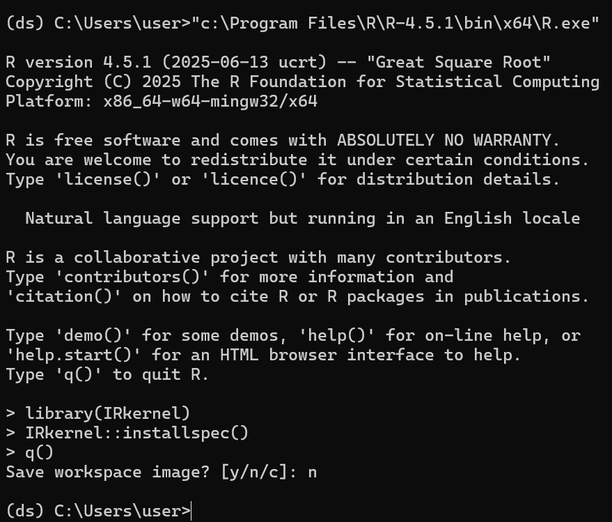

上の図にあるように。Rコンソールに次の2行をコピペして実行してください。

```R
library(IRkernel)
IRkernel::installspec()
```

実行しても**何も起こりませんがそれでOKです**。むしろエラーっぽい状況が発生したら、私に相談してください。

以上でminiforgeとRのリンクは確立されました。Rを終了しましょう。上図のようにRコンソールに`q()[ENTER]`と入力して`Save workspace image? [y/n/c]`と表示されるので、キーボードの`n`を入力すれば、Rは終了します。

## 5. VS Code のインストール

[https://code.visualstudio.com/](https://code.visualstudio.com/) から VS Code をダウンロードします。SafariやChromeでこのWebサイトを開くと、目立つところに窓マーク＋Download for Windows というリンクが見えるので、それをクリックしてインストーラーをダウンロードします。

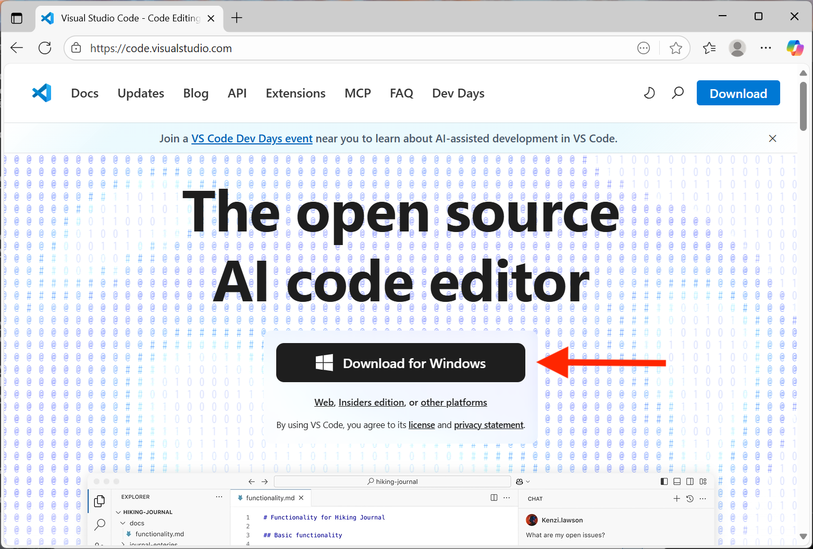

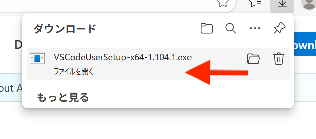

ダウンロードしたインストーラーの「ファイルを開く」をクリックして、インストールを開始します。インストールはとても簡単で、常に`[次へ/Next >]`または`[Install]`ボタンをクリックしていけばOKです。

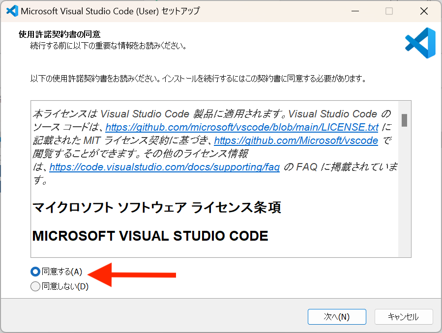
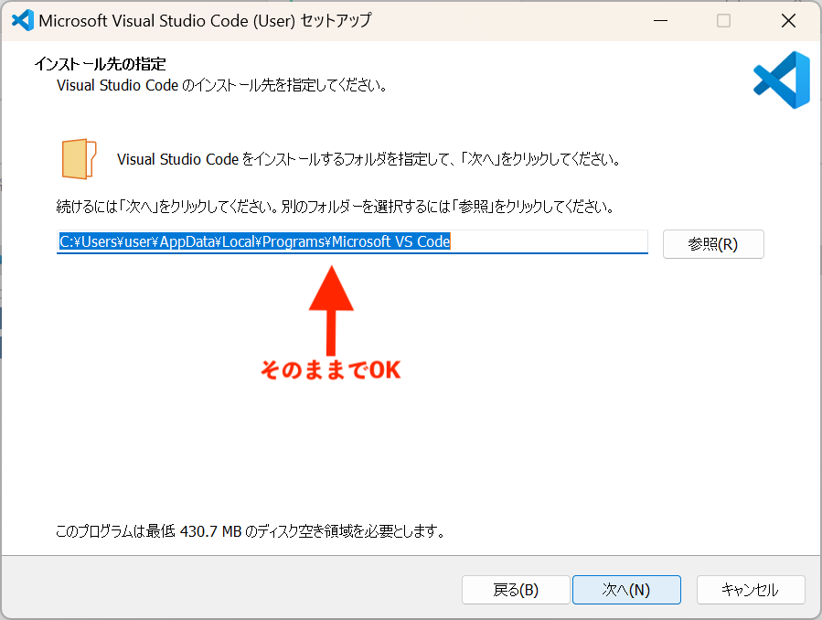
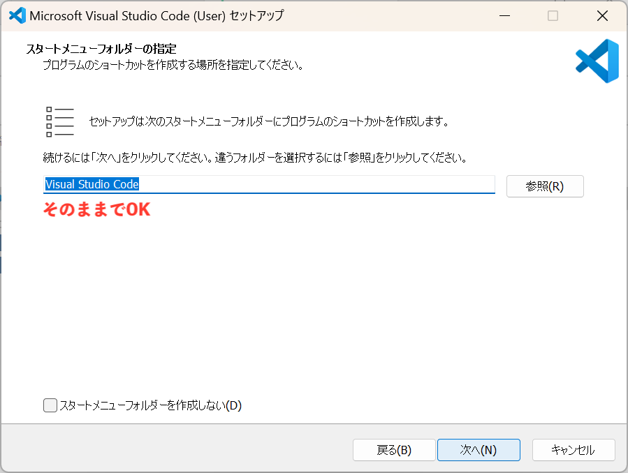
インストールオプションでは、`その他`の4つにオプションを入れると便利です（必須ではありません）。
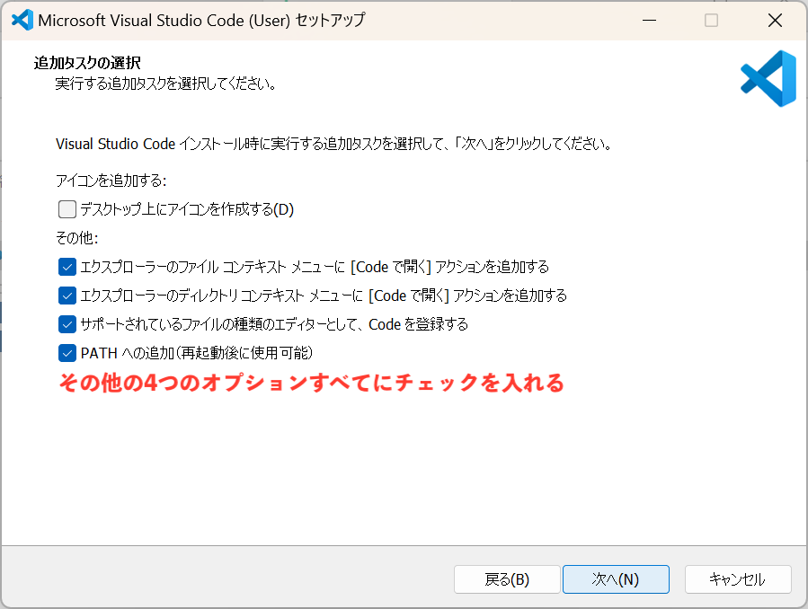
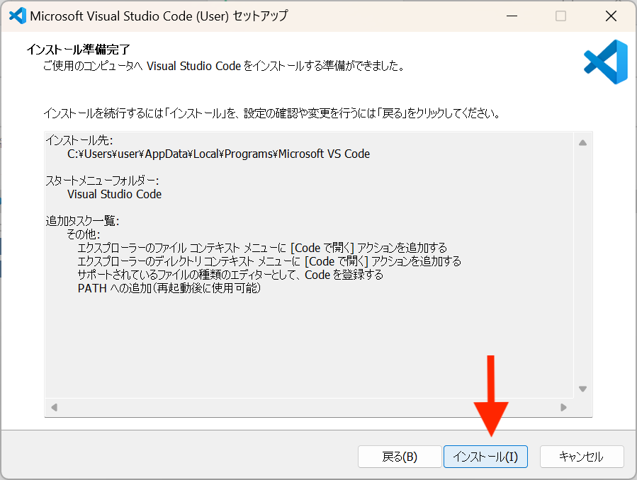
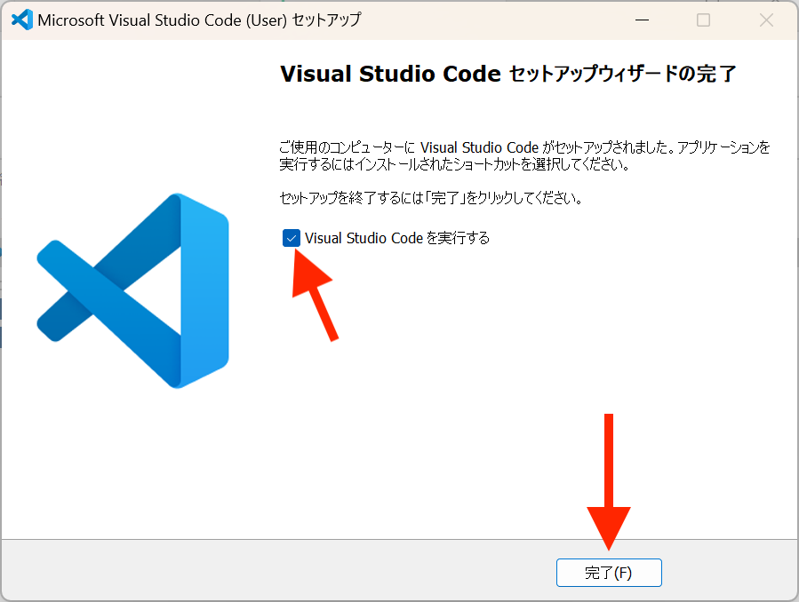

Windowsスタートメニューの中に`Visual Studio Code`というアプリがインストールされているので、これをクリックして起動します。

### VS Codeの環境設定

VS Codeはものすごく高機能なエディタで、AIエディタ（AIと相談しながらプログラムコードを書いていく）としても活用できます。その方法はおいおい詳述するとして、ここでは日々使うプログラミングエディタとして、必須の環境設定を行います。

#### VS Codeを日本語化する

VS Codeはデフォルトでは英語表示になっています。ウィンドウ左端の「拡張機能アイコン」をクリックし、検索窓に`japanese`と入力します。すると、**Japanese Language Pack for Visual Studio Code**という拡張機能があります。これはVS Codeの外観やメニューをできる限り日本語表示してくれます。

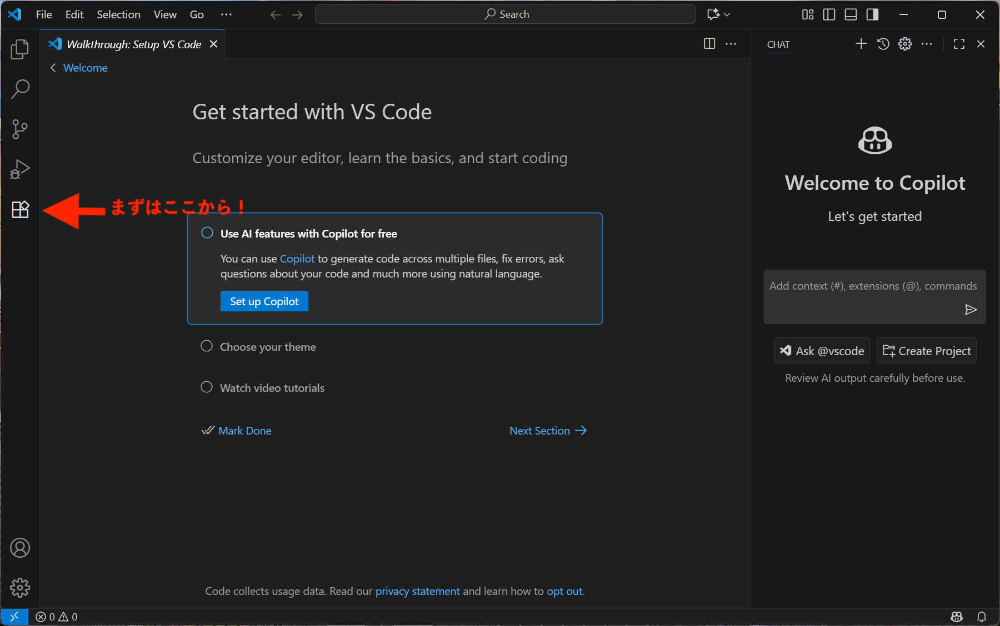

右下に青字に白文字で「**install**」というボタンがあるので、それをクリックすると、拡張機能がインストールされます。

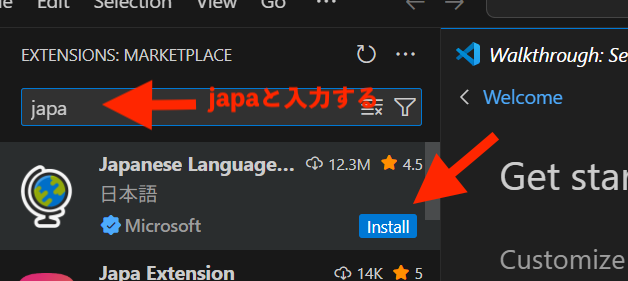

インストールが成功すると、下のようなメッセージが表示されるので、`Change Language and Restart`をクリックすれば、**日本語化された VS Code**が出現します。よく使うメニューや説明が日本語に切り替わっていることに気づくと思います。


#### Python拡張機能

再び機能拡張ボタンをクリックします：

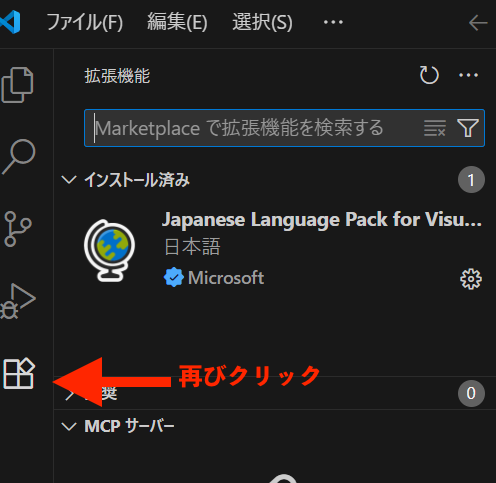

出現した検索窓に`Python`と入力して下さい。そして出現した拡張機能のうち、次の2つを見つけます

* **Python**：Pythonプログラミングに最適な機能を提供(開発者：Microsoft)
* **Pylance**：Pythonプログラミング文法を自動スペルチェック(開発者：Microsoft)

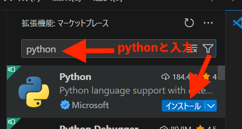

おそらく拡張機能**Python**をインストールすると、**自動的にPylanceもインストールされる**はずです。

#### Jupyter拡張機能

検索窓に`Jupyter`と入力して下さい。そして出現した拡張機能のうち、次の3つを見つけて、**インストール**してください。

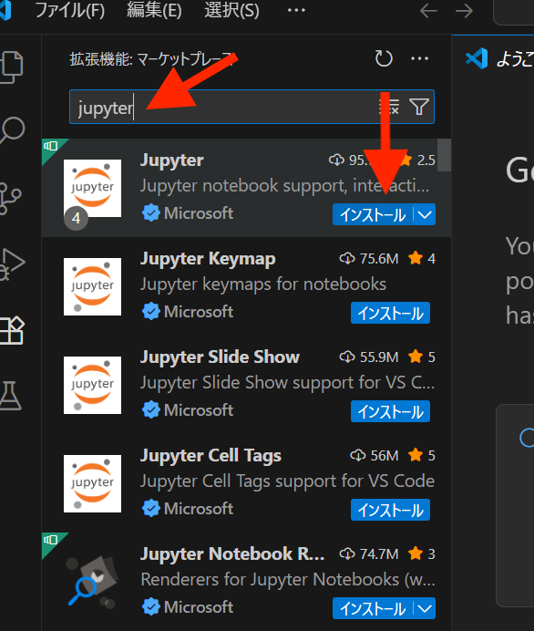

* **Jupyter**：Jupyter拡張機能本体 (開発者: Microsoft)
* **Jupyter Keymap**：Jupyter操作にショートカットを提供(開発者：Microsoft)
* **Jupyter Cell Tags**：プログラムにタグをつける(開発者：Microsoft)

**Jupyter**をインストールすれば、自動的に他の２つもインストールされるはずです。

### おめでとうございます

以上でPython+Rのプログラミング環境の基本設定は完成です！

VSCodeとターミナルを終了してOKです。
