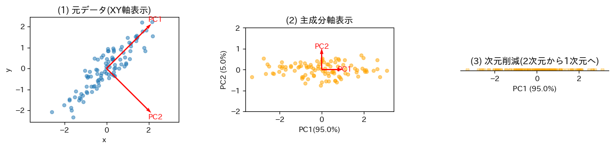
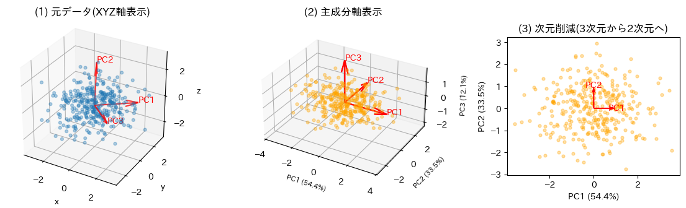
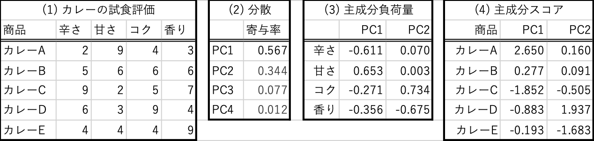
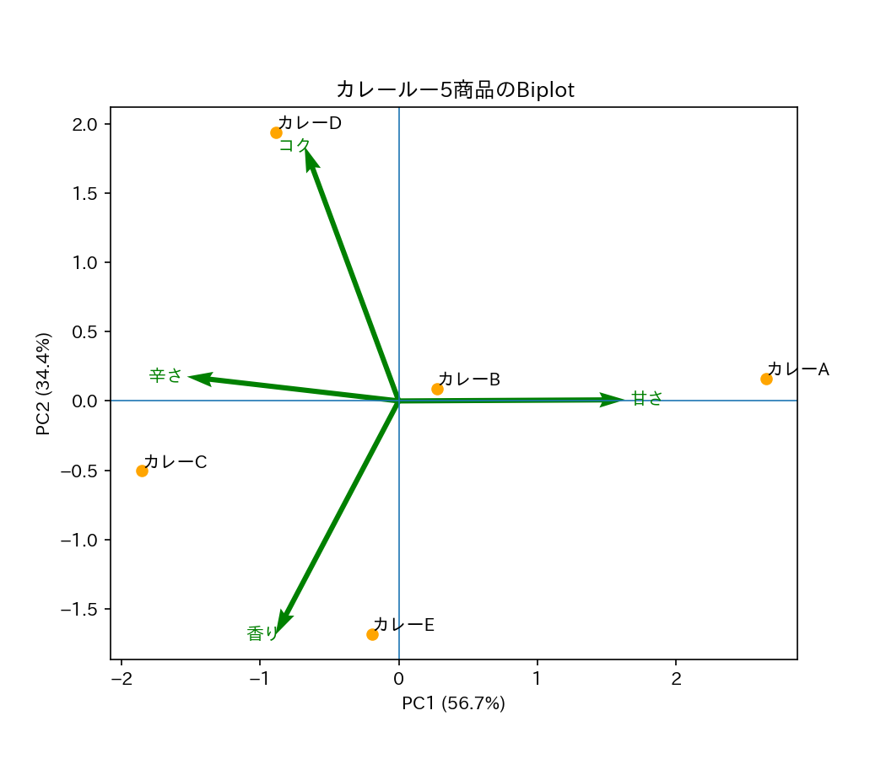
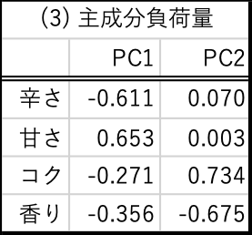

# PCAとBiplot

## 1. 主成分分析(PCA, 教師なし学習)

### 基本的な考え方



#### (1) 元データのばらつき

* 青色の各点は x座標が大きい(小さい)と、y座標が大きい(小さい)という"相関"を示している
* この相関のあるばらつきを、最もはっきりに見れる方向を「**第1主成分**」と呼び、PC1と表記する。
    * 第1主成分に直交する方向を「**第2主成分**」と呼び、PC2と表記する。
    * PC1、PC2は赤い矢印で示されている。
    * PC1とPC2をまとめて「**主成分負荷量**」と呼ぶ。

#### (2) 元データを主成分軸上にマッピング

* 元データを、赤矢印の座標軸(第1主成分を横軸・第2主成分を縦軸)を用いた平面で表示する。
    * (1) の散布図に使われるXY軸を"回転し"、互いに直交する主成分軸上の座標に変換していると考える。
* 青点の座標は、オレンジ点の座標に変換される。
    * 変換後のそれぞれのオレンジ点の座標を「**主成分スコア**」と呼ぶ。
* 主成分軸で見たオレンジ点(主成分スコア)のばらつきは、PC1軸で幅広く観察できる(±3くらいの範囲でばらついていることが分かる)。
    * 一方、オレンジ点のPC2軸方向のばらつきは、とても小さい(±1未満)。

#### (3) 次元削減と寄与率
* オレンジ点のばらつきがPC1軸で幅広く観察できならば、PC2軸のばらつきは**切り捨てても支障ない**という考え方が「**次元削減**」である。
    * PC2軸を切り捨てた結果、元データの2次元の座標のばらつきは、変換後のPC1軸のみを使った1次元の座標のばらつきを見るだけでよくなった。
* 主成分分析では、各主成分が元データのばらつきの大きさを説明する比率が得られる。この比率を**寄与率**と呼ぶ。主成分軸の名前の横に`(XX %)`という比率表示が掲載されることが多い。
    * PC1軸方向では、元データのばらつきの95%を説明している。
    * PC2軸では、元データのばらつきの、わずか5%しか説明していない 
    * → ならば、PC2主成分方向のばらつきを切り捨てても問題ないと考えるのが、**次元削減**

:::{important}
このように、元データの相関を維持したまま、ばらつきが最もはっきり分かる座標軸を発見する分析方法を、**主成分分析**(PCA)と呼ぶ。

* 主成分は、元データの次元数だけ存在する。
    * (1)のデータは2次元(x,y)なので、主成分は第1主成分・第2主成分の2つ。
* 図の色に対応する用語を整理することが、とても大事
    * 青点：元データ
    * 赤矢印：PCAで計算された主成分=**主成分負荷量**
    * オレンジ点：青点が主成分ベクトル軸の座標に変換された**主成分スコア**

主成分分析を実行した結果、**寄与率**の高い主成分のみを用いることを、**次元削減**と呼ぶ。
:::

### 主成分分析をPythonで実行する

どんなデータが対象となっていても、Pythonの主成分分析プログラミングは、いつも同じステップを踏むだけで良い。次の4行を書くだけで分析が完了する。

```python
pca = PCA(n_components=2)      # 分析準備
scores = pca.fit_transform(X)  # X：元データ(青点) → scores：主成分軸上のオレンジ点
loadings = pca.lodings_        # loadingsは主成分負荷量：赤い矢印
pca.explained_variance_ratio_  # 寄与率
```

:::{note}
必ず理解すべき**用語**

* 主成分と主成分負荷量：赤矢印
* データと主成分スコア：青点とオレンジ点
* 寄与率：主成分軸の括弧内に表示される比率(%)

図と関連づけて理解することが大事。
:::

### 3次元データの次元削減(100個のデータ、3つの属性)→次のバイプロットの説明のための橋渡し

用語とグラフの色の関係を意識しながら、読み解いてみよう。



* (1) 元データ(青点)は、3次元(XYZ軸)の散布図で描画されている
    * 主成分分析によって、3つの主成分が計算される。
    * PC1は、元データのばらつき(相関)を最もはっきり見える方向。
    * PC2は、PC1と直交している。
    * PC3は、PC1, PC2と直交している。
* (2) 元データ(青点)を主成分軸上の座標に変換し、主成分スコア(オレンジ点)が得られる。
    * 寄与率を調べてみると：
        * PC1：54.4%
        * PC2：33.5%
        * PC3：12.1%
    * PC1とPC2で元データの変動の87.9%を説明できている。
* (3) **次元削減**：PC3は元データの変動を、12.1%しか説明できていない。
    * よって、PC3軸上の変動を**切り捨てても問題ない**と判断する。
    * オレンジ点のPC1軸・PC2軸上の座標のみを用いた、**平面(2次元)を得る**。

---

## 2. Biplot

**PCA→次元削減 の考え方を用いて作られるグラフ** 

フードデータ分析では、
* Excelで与えられるデータ構造は、3次元以上のデータ
    * 1つの商品につき、3つ以上の属性(味・価格・等級など)
    * 次元の数＝商品の属性に設定した**変数の数**
* 商品の属性の違いを理解するために、**PCA → 次元削減**を使って2次元に落として理解する

という分析作業が主流である。この作業は、**バイプロット**(**Biplot**)と呼ばれるグラフ上を用いて実施される。

### 典型的な例



> 4つの表が何を表しているか、理解することがとても大事

* (1) **元データ** カレーの試食評価データ(5行**4列**)
    * 5つのカレー商品について、「辛さ・甘さ・コク・香り」という4つの観点から10段階評価されたデータ
    * 評価項目=**属性が4**つのあるので、**4次元データ**と呼ばれる。
    * 分析目的は、このデータを、各カレーの違いがよく分かるように可視化すること。
* (2) 元データを用いて**PCAを実行**した。寄与率を調べると、PC1とPC2で、データのばらつきの91.1%(=0.567+0.344)が説明できる。
    * (**次元削減**) PC3とPC4は切り捨てても問題ないと判断する。
* (3) 次元削減によって用いることになった2つの主成分負荷量(主成分ベクトルPC1, PC2)が、元データの**4つの評価項目からどのように構成されるか**を表した表
    * それぞれの主成分ベクトルは、元データの数値を用いて、次のように一次結合で計算されることを意味している。
    \begin{align*}
    PC1 &= -0.611 \times 辛さ + 0.653\times 甘さ -0.271\times コク -0.356\times 香り  \\
    PC2 &= 0.070 \times 辛さ + 0.003\times 甘さ +0.734\times コク -0.675\times 香り
    \end{align*}
* (4) 各カレーの主成分スコア
    * 主成分軸(PC1/PC2平面)上でのカレーA〜Eの座標が$(PC1, PC2)$の形で記載されている。


表(3)と表(4)をPC1-PC2平面に表したグラフを、**バイプロット**(**Biplot**)と呼ぶ。



### Biplot(バイプロット)の読み解き方[重要]

#### (1) 商品間の特徴の違いを、オレンジ点の位置で把握する。

* 5つのカレー商品の評価の類似性をオレンジ点(主成分スコア)で表している。
    * 点が**近い**と、評価は**似ている**
    * 点が**遠い**と、評価は**異なる**
    * **原点に近い**と、全体的に**平均的な評価**

#### (2) 評価項目の関係性を、緑矢印で把握する。

* 緑矢印は、表(3)の評価項目の(PC1, PC2)要素を2次元ベクトル表示したもの
    * 矢印の方向で、4つの評価項目の関係性が見える
    * **同じ**方向：評価項目の**点数が似ている**(正の相関)
    * **逆の**方向：評価項目の**点数も真逆の傾向**(負の相関)
    * **直交**していると、評価項目の**関係が薄い**(無相関)

#### (3) Biplotに対して、人間が必ず行う作業＝主成分軸の意味づけ

Biplotでは、軸がカレーの特徴の何を表しているか、主成分分析の結果を用いて言語化する。

* PC1は、カレー評価の何を表した軸なのか？
* PC2は、カレー評価の何を表した軸なのか？

定番の手法は、次の4ステップである：

1. 表3の数値、または数式(1)を情報源として使う。
2. 計算された係数の、**符号を観察**
    * 符号が同じ → 評価項目の特徴は、似ている
    * 符号が違う → 評価項目の特徴は、真逆である
3. 符号が同じグループごとに、計算された係数の、**絶対値の比較**
    * 絶対値が大きい評価項目ほど、主成分軸に与える影響が大きい。
4. 以上から、符号が異なる評価項目グループごとに、絶対値が最大のものをメインに意味づけを考える。

##### 解釈例:



* PC1軸の意味づけ
    * 符号
        * 甘さのみプラス、それ以外は全てマイナス
    * 絶対値の大きさ
        * プラス項目は甘さのみ
        * マイナスの3項目のうち|辛さ|＞|香り|＞|コク| → 辛さに着目

👉 解釈例：**PC1軸の負の方向は辛さを表し、正の方向は甘さを表す** 

* PC2軸の意味づけ
    * 符号
        * 香りのみマイナス、それ以外は全てプラス
    * 絶対値の大きさ
        * プラス項目は、|コク|＞|辛さ|》|甘さ| → コクに着目

👉 解釈例：**PC2軸の負の方向は香りを表し、正の方向はコクを表す** 

#### (4) ひとつの商品の特徴を明らかにする

* Biplotの図でオレンジ点(商品)と緑矢印(評価項目)の位置関係を観察
* **緑矢印の方向に位置する商品**は、その矢印の評価項目＝特徴が強い。
    * カレーA：甘さに特徴
    * カレーC：辛さに特徴
    * カレーD：コクに特徴
    * カレーE：香りに特徴

カレーBは、どの矢印の方向にもなく、原点に近い。このことは、カレーBはどの特徴も平均的な商品であることを示している。

### 商品のBiplot上の位置(主成分スコア)を求める方法

各カレー商品の位置は、表(1)の元データ(評価スコア)と、表(3)から作成した数式(1)から計算できる。
例えば、甘さに特徴のあるカレーAのBiplot上の座標は次のように計算する。

\begin{align*}
PC1座標 &=-0.611\times 2 + 0.653\times 9 - 0.271\times 4 -0.356\times 3 \\
        &=2.650 \\
PC2座標 &=0.070\times 2+ 0.003\times 9 + 0.734\times 4 -0.675\times 3\\
        &=0.160
\end{align*}

* 元データ：表(1)のみを使ってカレー商品の特徴を理解しようとするならば、5つの商品の4つの項目を総合的に理解しないといけないが、それは大変。
    * 実際の商品数は数百、評価項目は数十から数百になることもある。
* そこで、PCA→次元削減からBiplotを作成すれば、2つの主成分で構成される図で商品の特徴を理解することが可能。
    * この可能性こそが、マーケティングの商品分析などでBiplotが活用される最大の理由である。

