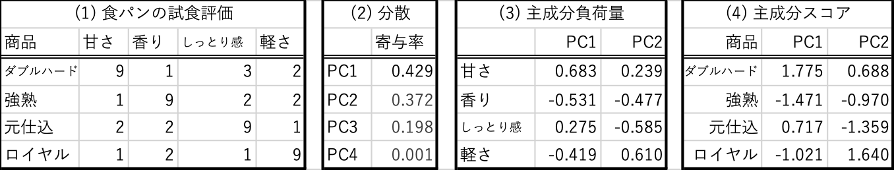
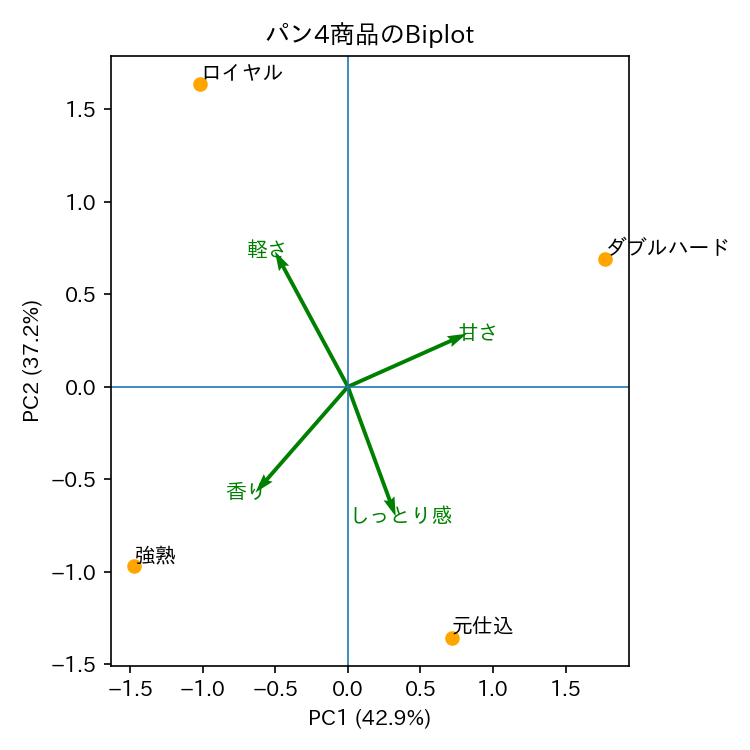

# PCA：理解確認問題

仮想的な食パン4商品について、試食評価を実施し、表(1)を得た。
主成分分析を行った結果が表(2)から表(4)に示されている。

以下5問について、1行程度の解答を作成しなさい。

### Q1
分析結果から、2次元での可視化が妥当と言える理由を説明しなさい。

次に、2つの主成分軸でバイプロットを作成した。

### Q2
PC1はどのような特徴を表す軸と解釈できるか、説明しなさい。

### Q3
PC2はどのような特徴を表す軸と解釈できるか、説明しなさい。

### Q4
商品「ダブルハード」の特徴とな何であるか、説明しなさい。

### Q5
商品「ロイヤル」のPC2軸の座標を計算する式を、記述しなさい。

