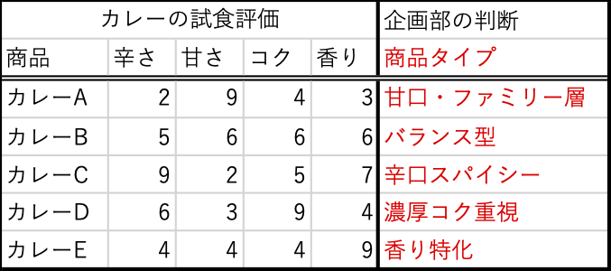
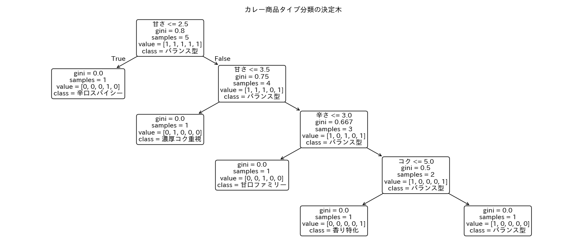
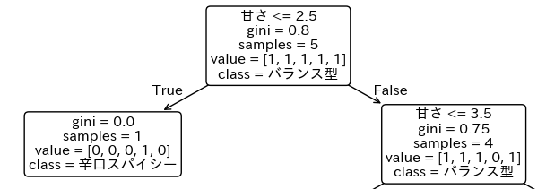
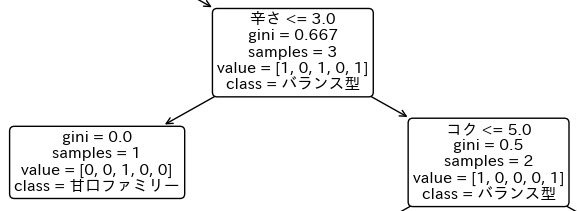
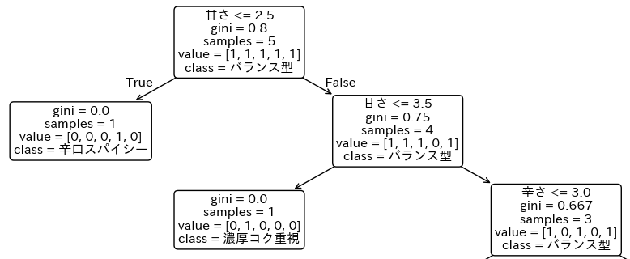
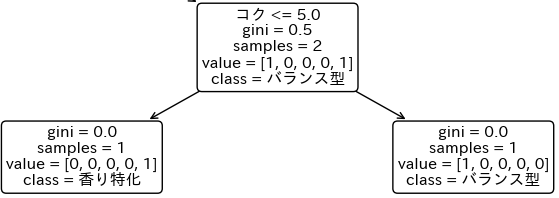

# Dtree

## 教師あり学習データ

下表の左側は、PCAの例題で使ったもので、カレーの試食によって得た10段階評価データである。

新たに右側に追加した「**企画部の判断**/**商品タイプ**」という列は、各カレー商品について、社内の商品企画担当者が「試食評価をもとに、主にどんな特徴を売りにしている商品か」を1つ選んで、**ラベル付け**したデータである。



ラベル付けの判断基準は、例えば：

* カレーAは、甘さの評価が高い(9) 
    * → 甘口・ファミリー層という特徴が付いた。
* カレーBは、どの特徴も中程度
    * → 際立った特徴がない、バランス型という特徴が付いた。
* カレーCは、辛さ(9)と香り(7)の評価が高い
    * → 辛口スパイシーという特徴が付いた。
* カレーDは、コクの評価が高い
    * → 濃厚コク重視という特徴が付いた。
* カレーEは香りの評価のみが高い(9) 
    * → 香り特化という特徴が付いた。

「企画部の判断」データが存在しない場合、試食評価のデータのみを用いて、商品同士の似ている・異なるといった構造を明らかにする分析を行うことになる。
* このように、ラベルのような判断結果の情報が付いていないデータを扱う分析を、**教師なし学習**（**unsupervised learning**）と呼ぶ。
* **PCA**（主成分分析）は、代表的な教師なし学習の手法であり、データのばらつき構造を可視化・要約することを目的とする。

一方、商品タイプのような判断結果の情報（ラベル）が付いている場合、その結果をもとに、試食評価の属性から商品タイプを予測・判断するルールを学習する分析を行う。
* このような分析手法を、**教師あり学習**（**supervised learning**）と呼ぶ。
* **Dtree** (決定木)は、評価項目属性とラベルデータを用いて、判断ルール**if-else形式**のを決定木の形で可視化する、教師あり学習手法である。

## Dtree

Pythonでは、どのようなラベル付きデータに対しても、次のようなわずか数行のプログラム文によって、決定木分析を実行することができる。
```python
# 決定木分析関数は、scikit-learnに含まれている
from sklearn.tree import DecisionTreeClassifier

# dfには上記の表が入っている。これを2つの変数に分ける
X = df[["辛さ", "甘さ", "コク", "香り"]]　# Xには評価項目データ
y = df["商品タイプ"]　## yにはラベルデータ
# 決定木分析オブジェクトを作成
model = DecisionTreeClassifier(
    criterion="gini", max_depth=None, random_state=0 
)
# X, yを使って決定木分析を実行
model.fit(X, y)
```

分析結果の決定木を可視化したものが、以下の図である。この決定木が、データから"プログラムが学習した"、if-else形式の判断ルールの全容である。



:::{important} 重要事項
決定木の構造と出力内容を理解していること。

* **条件分岐**ノードと、分類の完了した**葉**(**リーフ**)の見分けがつくこと。
* 商品の**分類ルール**を、ノード記載の**条件**を使って書き下せること。
* Gini不純度の減少の観点から、**最も重要な**評価項目属性を突き止めること。

:::

### 1. 決定木の構造

決定木の最上位のノードは、**ルート**ノードと呼ばれる。この決定木で最初に用いられる条件分岐である。



ルートノードの条件分岐に使われている変数は「甘さ」である。`samples=5`、すなわち5つの商品を、評価項目の`甘さ<=2.5`で分類している。ノードから伸びる2つの線が、条件判定の結果による分岐である。これを`if-else`で書くと
```python
if "甘さ" <= 2.5:
    # 条件判定の結果がTrueのとき、左側のノードへ
    # 評価項目「甘さ」が2.5以下の1商品が分かれる
else:
    # 条件判定の結果がFalseのとき、右側のノードへ
    # 評価項目「甘さ」が2.5より大きい4商品が分かれる
```
となる。

左側のノードは、
* `samples=1`：1つの商品のみ(辛口スパイシー)がノードに含まれる。
* 商品数が1のノードでは、**分類が終了**したことを表している。このようなノードを**葉**(**リーフ**)と呼ぶ。
* 決定木全体で、商品数だけ葉があることを確認しよう。

右側のノードは、
* `samples=4`：残り4つの商品がノードに含まれる
* このノードでは、次の判断ルール：`甘さ<=3.5`を適用している。

### 2. 各商品が分類されるルールを理解する

:::{note} ルールの把握方法
1. 商品の分類が完了している葉の位置を、ルートノードから辿る
2. ルートノードから葉に辿り着くまでの左右のノードで使った条件をまとめて、ルールとする。
:::


#### 「辛口スパイシー」の分類ルール

1.「辛口スパイシー」の葉へは、ルートノードから次のようにたどり着ける。

* スタート：ルートノード
    * → 左のノードへ
        * `甘さ<=2.5`が`True`
    * → ゴール：葉に到着

* 葉までの条件を**列挙**する：
    * 「甘さ<=2.5」

> **ルール：「甘さ<=2.5」**

####  「甘口ファミリー」の分類ルール

「甘口ファミリー」の葉へは、ルートノードから次のように辿り着ける。

* スタート：ルートノード
    * → 右のノードへ
        * `甘さ<=2.5`が`False` 
    * → 右のノードへ
        * `甘さ<=3.5`が`False`
    * → 左のノードへ
        * `辛さ<=3.5`が`True`
    * → ゴール：葉に到着

* 葉までの条件を**列挙**する：
    * 「甘さ>2.5」
    * 「甘さ>3.5」
    * 「辛さ<=3.5」
* 甘さの2つの条件をまとめよう。
    * 甘さ>2.5、甘さ>3.5 → 甘さ3.5ひとつにまとめられる。

> **ルール：「甘さ>3.5、辛さ<=3.5」**

#### 商品を分類する「決定的なルール」

:::{note}
葉の**直前**にあるノードの分岐条件は、各商品を最終的に分類する決定的なルールと呼ぶ。
:::

* 辛口スパイシー：`甘さ<=2.5`
* 濃厚コク重視：`甘さ<=3.5`
* 甘口ファミリー：`辛さ<=3.5`
* 香り特化：`コク<=5.0`
* バランス型：`コク>5.0`

一番下にある葉「バランス型」だけ、条件が`False`になったときが決定的なルールとなっていることに注意。


### 3. 最も重要な評価項目(属性)を突き止める

この決定木では、合計4つの条件分岐が実施されていることを確認しよう。それぞの条件分岐ノードでは、ひとつの評価項目属性(変数)に関する`if-else`が対応している。

カレー商品の特徴である甘さ・辛さ・コク・香りのうち、どの属性(変数)が決定木全体の分類に最も貢献しているだろうか。このことを定量化するには、変数ごとのGini不純度の**減少分**を計算する。

* 全体の商品数を$N_0$とする。
* 変数Aが使われている条件分岐ノードに$N$個の商品があり、Gini不純度を$G$とする。
* 分岐したあとの2つのノードに注目する
    * 左のノードの商品数を$n_L$、Gini不純度を$G_L$とする。
    * 右のノードの商品数を$n_R$、Gini不純度を$G_R$とする。

このとき、変数Aの**貢献度**＝変数AによるGini不純度の減少分は、次のように計算される：

:::{note} 減少分の計算式
$$
\frac{N}{N_0}\left[G - \left(\frac{n_L}{N} G_L + \frac{n_R}{N}G_R\right)\right]
$$
:::
* 直感的な意味：分岐前のGini不純度と分岐後の平均Gini不純度(`()内`)の差（`[]内`）に、そのノードでの対象商品数の比率を掛ける。

#### 例1： 「辛さ」の貢献度
評価項目「辛さ」は、決定木中盤で条件分岐に使われている。



3つの商品を、`辛さ<=3.0`で分岐させると、左側では1商品・Gini不純度=0.0、右側では2商品・Gini不純度0.5である。このことから「辛さ」の貢献度は次のように計算できる。
$$
\frac{3}{5}\left[0.667 - \left(\frac{1}{3}\times 0.0 + \frac{2}{3}\times 0.5\right)\right] = \frac{3}{5}\times 0.333 = 0.2
$$

#### 例2： 「甘さ」の貢献度
評価項目「甘さ」は、決定木序盤の**2回の**条件分岐で使われている。



1. ルートノード(Gini不純度0.8, samples=5)
    * 左のノード(Gini不純度0.0, samples=1)
    * 右のノード(Gini不純度0.75, samles=4)
    * このノードでの「甘さ」の貢献度
$$
\frac{5}{5}\left[0.8 - \left(\frac{1}{5}\times 0.0 + \frac{4}{5}\times 0.75\right) \right]= 1\times 0.2 = 0.2
$$

2. 2番目のノード`甘さ<=3.5` (Gini不純度0.75, samples=4)
    * 左のノード(Gini不純度0.0, samples=1)
    * 右のノード(Gini不純度0.667, samples=3)
    * このノードでの「甘さ」の貢献度
$$
\frac{4}{5}\left[0.75 - \left(\frac{1}{4}\times 0.0 + \frac{3}{4}\times 0.667\right)\right] = \frac{4}{5}\times 0.25=0.2
$$

「甘さ」の貢献度は、2つのノードでの貢献度の総和で定義される：
$$
\textrm{「甘さ」の貢献度} = 0.2+0.2=0.4
$$

#### 例3: 「コク」の貢献度
変数「コク」は、この決定木の最後の条件判定で使われている。



* このノード
    * 商品数=2
    * Gini不純度=0.5
* 左のノード
    * 商品数=1
    * Gini不純度=0.0
* 右のノード
    * 商品数=1
    * Gini不純度=0.0
$$
\frac{2}{5}\left[0.5 - \left(\frac{1}{2}\times 0.0 + \frac{1}{2}\times 0.0\right)\right] = \frac{2}{5}\times 0.5=0.2
$$

#### 例4：「香り」の貢献度

決定木をみると、条件分岐に変数「香り」は使われていない！このようなときは、
「香り」の貢献度を「0」と定義する。

#### 最大の貢献度をもつ変数は？
* 甘さ：0.4
* 辛さ：0.2
* コク：0.2
* 香り：0

**👉決定木において最も重要な役割を果たしているのは「甘さ」である**

:::{note} 最大の貢献度をもつ変数をクイックに探す方法

* ルートまたはルートに近いノードで使われている変数
* 複数の条件分岐ノードで使われている変数

は、**最大の貢献度の変数**である可能性が高い。なぜなら、

* ルートに近ければ近いほど分類が終わっていない商品が多いので、計算式(1)の$N/N_0$の分子$N$が大きい
    * →(1)**式の値は大きくなる**。
* 複数のノードで使われていれば、貢献度は各ノードでの貢献度の**総和**になる。
    * →多くのノードで使われていれば、貢献度が加算されていく。
:::

変数「甘さ」は、ルートノードの分岐で使われ、そのすぐ下のノードの分岐でも使われている。**ルートノード近辺で複数回**使われているので、最大の貢献度となっている。
