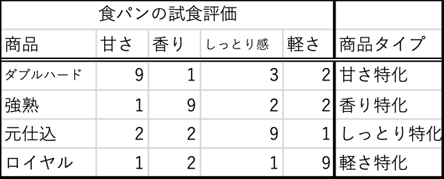
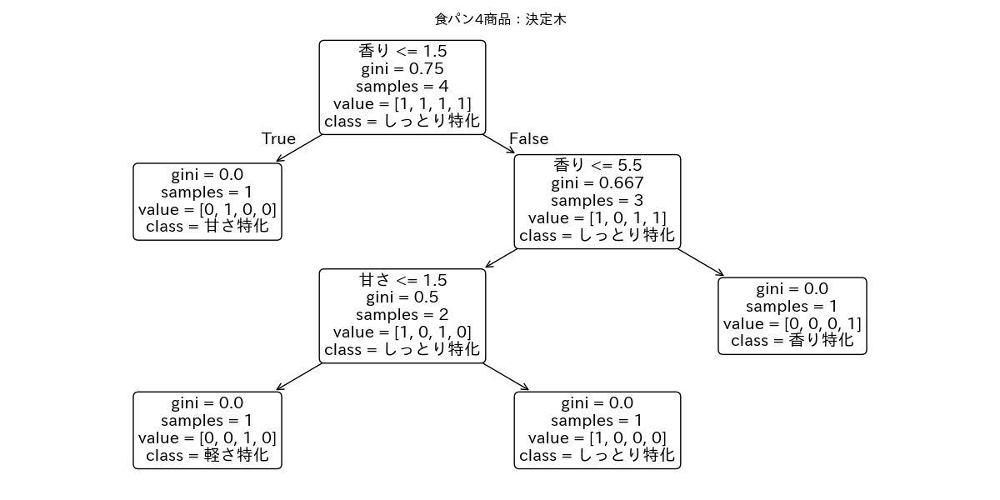

# Dtree：理解確認問題

食パン4商品について、試食評価データと、対応する商品タイプデータがある。

4商品が商品タイプに分類されるルールを決定木で表したのが下図である。

以下5問について、1行程度の解答を作成しなさい。

### Q1

この決定木において 「甘さ特化」 に分類されるためのルールを記述しなさい。

### Q2
この決定木において 「香り特化」 に分類されるためのルールを記述しなさい。

### Q3

この決定木では、甘さ特化 と 香り特化 を区別する決定的な属性は何か。

### Q4

この決定木で、軽さ特化 と しっとり特化 を区別する際に、最終的に決め手になっている属性は何か。

### Q5

この決定木全体において、Gini不純度の減少に最も貢献している（＝最も重要な）属性は何か。理由もつけて答えなさい。
